# E-Commerce Platform — Architecture Blueprint

> **Clone-Per-Vendor · Clean Architecture · .NET 9 · MSSQL**
>
> Single source of truth for the backend architecture of a generic, clone-per-vendor e-commerce platform.
> Every vendor deployment is driven entirely by `config/vendor.config.json` and `theme/` — **zero C# modifications** required.

---

## Table of Contents

1. [Architectural Mandates](#1-architectural-mandates)
2. [System Architecture](#2-system-architecture)
3. [Phase A — Vendor Configuration](#3-phase-a--vendor-configuration)
4. [Phase B — Domain Layer](#4-phase-b--domain-layer)
5. [Phase C — Application Layer](#5-phase-c--application-layer)
6. [Phase D — Infrastructure Layer](#6-phase-d--infrastructure-layer)
7. [Phase E — API Layer](#7-phase-e--api-layer)
8. [Phase F — Testing & CI/CD](#8-phase-f--testing--cicd)
9. [Phase G — Execution Roadmap](#9-phase-g--execution-roadmap)

---

## 1. Architectural Mandates

| Mandate | Rule |
|---|---|
| **Tenancy** | Single-tenant, clone-per-vendor. Same codebase, separate infra per vendor. |
| **Core Discipline** | Cloning for a new vendor MUST ONLY require modifying `theme/` and `config/vendor.config.json`. |
| **Architecture** | Clean Architecture: Domain → Application → Infrastructure → API |
| **Database** | Microsoft SQL Server (MSSQL) |
| **Auth** | Internal JWT (HS256) + OAuth 2.0 (Google, Facebook) |
| **Payments** | Stripe, PayPal, Paymob — config-driven activation |
| **Caching** | IMemoryCache (default) ↔ Redis — single config toggle |
| **Real-Time** | SignalR for admin dashboard push notifications |
| **Email** | SendGrid + SMTP fallback — config-driven swap |
| **Runtime Config** | DB-backed via Admin API (no file-watcher, no restart) |

---

## 2. System Architecture

### 2.1 High-Level Architecture

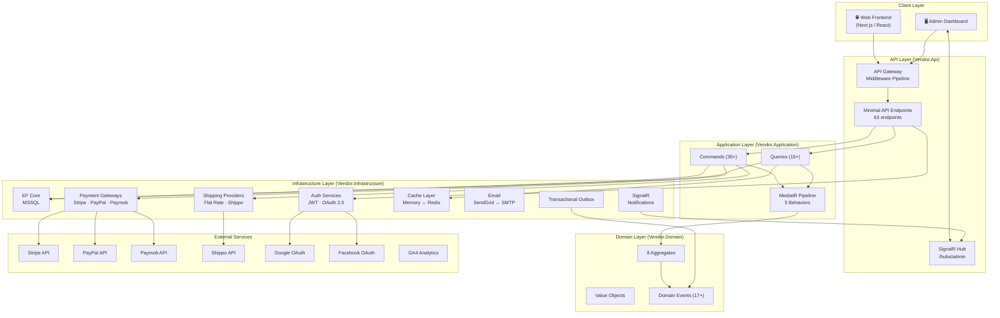

### 2.2 Solution Structure

```
e-commerce-prototype/
│
├── config/
│   ├── vendor.config.json              # THE vendor-specific config (only file vendors modify)
│   └── vendor.config.schema.json       # JSON Schema for CI validation
│
├── theme/
│   ├── assets/                         # Logo, favicon, hero images
│   └── templates/                      # Email templates, page overrides
│
├── src/
│   ├── Vendor.Domain/                  # 🟢 ZERO external dependencies
│   │   ├── Aggregates/
│   │   │   ├── Product/
│   │   │   ├── Customer/
│   │   │   ├── Cart/
│   │   │   ├── Order/
│   │   │   ├── Payment/
│   │   │   ├── Shipment/
│   │   │   ├── Promotion/
│   │   │   ├── ReturnRequest/
│   │   │   ├── VendorSettings/
│   │   │   └── AnalyticsEvent/
│   │   ├── ValueObjects/
│   │   ├── Events/
│   │   ├── Enums/
│   │   ├── Exceptions/
│   │   └── Interfaces/
│   │
│   ├── Vendor.Application/            # Depends on: Domain
│   │   ├── Commands/
│   │   │   ├── Products/
│   │   │   ├── Cart/
│   │   │   ├── Orders/
│   │   │   ├── Payments/
│   │   │   ├── Shipments/
│   │   │   ├── Promotions/
│   │   │   ├── Returns/
│   │   │   ├── Customers/
│   │   │   ├── Analytics/
│   │   │   └── VendorSettings/
│   │   ├── Queries/
│   │   │   ├── Products/
│   │   │   ├── Orders/
│   │   │   ├── Payments/
│   │   │   ├── Customers/
│   │   │   ├── Promotions/
│   │   │   ├── Returns/
│   │   │   └── Analytics/
│   │   ├── DTOs/
│   │   ├── Behaviors/
│   │   ├── Interfaces/
│   │   ├── Mapping/
│   │   └── DependencyInjection.cs
│   │
│   ├── Vendor.Infrastructure/          # Depends on: Domain, Application
│   │   ├── Persistence/
│   │   │   ├── AppDbContext.cs
│   │   │   ├── Configurations/         # EF Core entity configurations
│   │   │   ├── Repositories/
│   │   │   ├── Migrations/
│   │   │   ├── Outbox/
│   │   │   └── Seeding/
│   │   ├── Payments/
│   │   │   ├── StripePaymentGateway.cs
│   │   │   ├── PayPalPaymentGateway.cs
│   │   │   └── PaymobPaymentGateway.cs
│   │   ├── Shipping/
│   │   │   ├── FlatRateShippingProvider.cs
│   │   │   └── ShippoShippingProvider.cs
│   │   ├── Auth/
│   │   │   ├── JwtTokenService.cs
│   │   │   ├── ExternalAuthService.cs
│   │   │   └── CurrentUserService.cs
│   │   ├── Email/
│   │   │   ├── SendGridEmailSender.cs
│   │   │   └── SmtpEmailSender.cs
│   │   ├── Caching/
│   │   │   ├── InMemoryCacheService.cs
│   │   │   └── RedisCacheService.cs
│   │   ├── RealTime/
│   │   │   ├── AdminNotificationHub.cs
│   │   │   └── SignalRNotifier.cs
│   │   ├── Analytics/
│   │   │   ├── GA4AnalyticsForwarder.cs
│   │   │   └── WebhookAnalyticsForwarder.cs
│   │   ├── Tax/
│   │   │   └── FlatRateTaxCalculator.cs
│   │   ├── Config/
│   │   │   └── EnvironmentSecretResolver.cs
│   │   └── DependencyInjection.cs
│   │
│   └── Vendor.Api/                     # Depends on: Application, Infrastructure
│       ├── Program.cs                  # Composition root
│       ├── appsettings.json
│       ├── Middleware/
│       │   ├── GlobalExceptionHandlerMiddleware.cs
│       │   ├── MaintenanceModeMiddleware.cs
│       │   ├── CorrelationIdMiddleware.cs
│       │   └── SecurityHeadersMiddleware.cs
│       ├── Endpoints/
│       │   ├── AuthEndpoints.cs
│       │   ├── ProductEndpoints.cs
│       │   ├── CustomerEndpoints.cs
│       │   ├── CartEndpoints.cs
│       │   ├── OrderEndpoints.cs
│       │   ├── PaymentEndpoints.cs
│       │   ├── ShipmentEndpoints.cs
│       │   ├── PromotionEndpoints.cs
│       │   ├── ReturnEndpoints.cs
│       │   ├── AnalyticsEndpoints.cs
│       │   └── VendorSettingsEndpoints.cs
│       ├── Filters/
│       │   └── ResultEndpointFilter.cs
│       └── HealthChecks/
│           └── PaymentProviderHealthCheck.cs
│
├── tests/
│   ├── Vendor.Domain.Tests/
│   ├── Vendor.Application.Tests/
│   ├── Vendor.Infrastructure.Tests/
│   └── Vendor.Api.Tests/
│
├── .github/workflows/ci-cd.yml
├── Dockerfile
├── docker-compose.yml
└── Vendor.sln
```

### 2.3 Dependency Direction

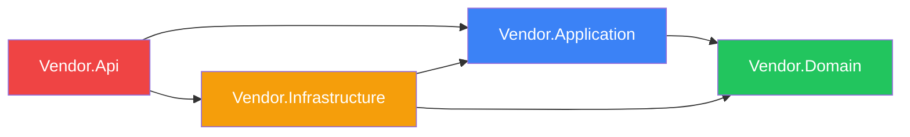

> **Domain has ZERO external NuGet dependencies.** All abstractions (repositories, adapters) are defined in Domain. Infrastructure implements them.

---

## 3. Phase A — Vendor Configuration

### 3.1 Configuration Architecture

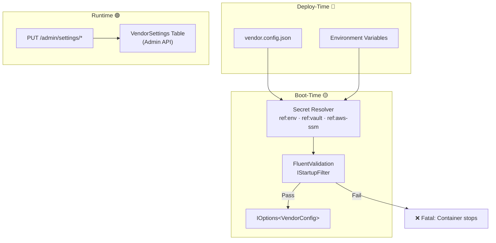

### 3.2 Configuration Sections

| Section | Tier | Purpose | Key Fields |
|---|---|---|---|
| `vendorId` | 🔴 Build | Unique vendor identifier | Lowercase alphanumeric + hyphens |
| `vendorDisplayName` | 🟢 Runtime | Store display name | Max 128 chars |
| `branding` | 🟢 Runtime | Logo, colors, fonts, SEO meta | `logoUrl`, `primaryColor`, `fontFamily`, `metaTitle` |
| `locale` | 🟡 Boot | Language, currency, timezone | `defaultLanguage`, `defaultCurrency`, `direction` (ltr/rtl) |
| `tax` | 🟡/🟢 Mixed | Tax calculation strategy | `strategy` (flat/tax-jar/avalara/none), `flatRatePercentage` |
| `checkout` | 🟢 Runtime | Checkout behavior | `allowGuestCheckout`, `maxItemsPerOrder`, `orderNumberPrefix` |
| `payments` | 🟡/🟢 Mixed | Payment provider configs | Array of providers with keys, methods, capture mode |
| `shipping` | 🟡/🟢 Mixed | Shipping provider configs | Array of providers with rates, thresholds, API keys |
| `promotions` | 🟢 Runtime | Promotion engine settings | `maxDiscountCodesPerOrder`, `evaluationStrategy` |
| `featureFlags` | 🟡/🟢 Mixed | Feature toggles | `enableReviews`, `maintenanceMode`, `enableAnalytics` |
| `analytics` | 🟡 Boot | Analytics tracking & consent | `trackingId`, consent modes, server-side forwarding destinations |
| `auth` | 🟡 Boot | JWT + OAuth 2.0 config | Token expiry, OAuth client IDs, password policy |
| `caching` | 🟡 Boot | Cache provider selection | `provider` (memory/redis), Redis connection string |
| `email` | 🟡 Boot | Email provider selection | `provider` (smtp/sendgrid), SMTP host/port, SendGrid key |

### 3.3 Secret Management

| Reference Prefix | Resolved From | Example |
|---|---|---|
| `ref:env:VARIABLE` | Environment variable (default) | `"ref:env:STRIPE_SECRET_KEY"` |
| `ref:vault:path` | HashiCorp / Azure Key Vault | `"ref:vault:vendors/acme/stripe-sk"` |
| `ref:aws-ssm:/path` | AWS SSM Parameter Store | `"ref:aws-ssm:/acme/stripe/secret-key"` |

All secret fields in JSON Schema enforce the `^ref:(env|vault|aws-ssm):.+$` pattern. CI pipeline includes a secret audit step that fails on raw secrets.

### 3.4 Validation Strategy

- **Boot-time:** `FluentValidation` inside `IStartupFilter` — fatally halts container on invalid config
- **CI-time:** `ajv-cli` JSON Schema validation + secret reference audit in GitHub Actions
- **Key rules:** Exactly one default payment provider, `defaultCurrency` must be in `supportedCurrencies`, `defaultLanguage` must be in `supportedLanguages`, secret fields must use `ref:` prefix

---

## 4. Phase B — Domain Layer

### 4.1 Aggregate Map

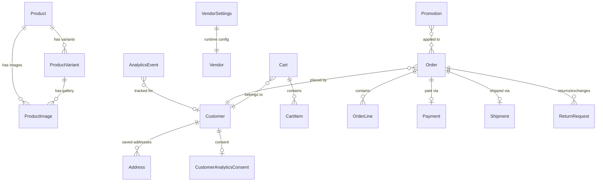

### 4.2 Aggregates & Key Invariants

| Aggregate | Strongly-Typed ID | Key Invariants |
|---|---|---|
| **Product** | `ProductId` | Cannot activate with price ≤ 0 or no images; variant SKUs must be unique within product; stock cannot go negative; raises `LowStockEvent` when below threshold |
| **ProductVariant** | `ProductVariantId` | Has own image gallery, price adjustment, stock tracking, attribute dictionary |
| **Customer** | `CustomerId` | Guest → registered conversion (one-way); email unique; consent tracking for analytics |
| **Cart** | `CartId` | Max items enforced; discount code can be applied/removed; abandoned detection via timeout; guest cart merge on login |
| **Order** | `OrderId` | Strict state machine (see below); total = subtotal + tax + shipping − discount ≥ 0; immutable lines after creation |
| **Payment** | `PaymentId` | Refund cannot exceed captured amount; partial refund supported; `IdempotencyKey` prevents double charges |
| **Shipment** | `ShipmentId` | Linear status progression; tracking number set on label creation |
| **Promotion** | `PromotionId` | Usage count tracking; auto-deactivates at max usage; percentage discounts capped by `MaximumDiscountAmount`; validity period enforced |
| **ReturnRequest** | `ReturnRequestId` | Must include ≥1 item; return vs. exchange flows diverge at completion; `CompleteReturn` → refund, `CompleteExchange` → replacement order |
| **VendorSettings** | `VendorSettingsId` | DB-backed runtime config; raises `SettingsUpdatedEvent` on changes |
| **AnalyticsEvent** | `AnalyticsEventId` | Immutable after capture; includes consent snapshot at capture time |

### 4.3 Order State Machine

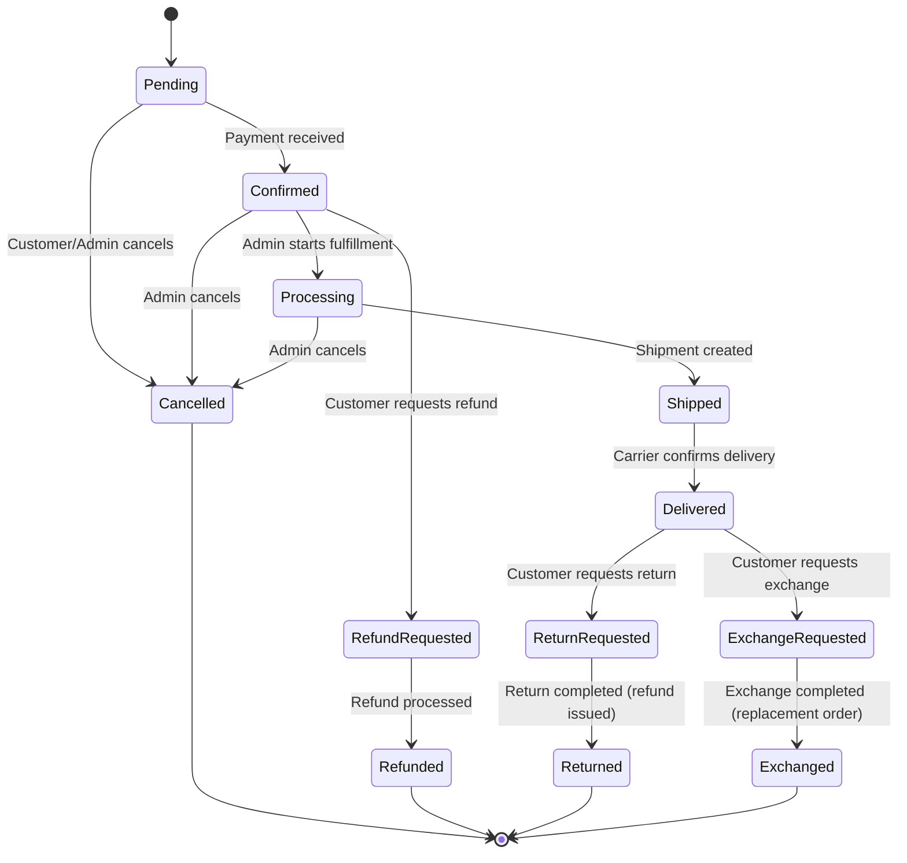

### 4.4 Value Objects

| Value Object | Fields | Key Rules |
|---|---|---|
| **Money** | `Amount`, `CurrencyCode` | Cannot add/subtract different currencies; `Multiply(factor)` for quantity math |
| **Address** | `Street`, `City`, `State`, `ZipCode`, `CountryCode`, `Phone`, `FullName` | Owned type in EF Core (embedded columns) |
| **DateRange** | `StartUtc`, `EndUtc` | End must be ≥ Start; `Contains(datetime)` check |
| **Slug** | `Value` | Must match `^[a-z0-9\-]+$`; validated at construction |
| **Weight** | `Value`, `Unit` | Units: lb, kg, oz, g |
| **Dimensions** | `Length`, `Width`, `Height`, `Unit` | Units: in, cm |

### 4.5 Domain Events

| Source Aggregate | Event | Trigger |
|---|---|---|
| Product | `ProductActivatedEvent` | `Activate()` |
| Product | `ProductDeactivatedEvent` | `Deactivate()` |
| Product | `ProductLowStockEvent` | Stock drops below `LowStockThreshold` |
| Customer | `CustomerCreatedEvent` | Registration or guest creation |
| Customer | `CustomerConsentUpdatedEvent` | Analytics consent changed |
| Order | `OrderPlacedEvent` | `Order.Create()` |
| Order | `OrderConfirmedEvent` | Payment received |
| Order | `OrderShippedEvent` | Shipment attached |
| Order | `OrderDeliveredEvent` | Delivery confirmed |
| Order | `OrderCancelledEvent` | Cancellation |
| Order | `OrderRefundRequestedEvent` | Refund requested |
| Payment | `PaymentCapturedEvent` | Successful capture |
| Payment | `PaymentFailedEvent` | Provider failure |
| Payment | `PaymentRefundedEvent` | Refund processed |
| Shipment | `ShipmentInTransitEvent` | Marked shipped |
| Shipment | `ShipmentDeliveredEvent` | Delivery confirmed |
| Promotion | `PromotionExhaustedEvent` | Max usage reached |
| VendorSettings | `VendorSettingsUpdatedEvent` | Admin updates settings |
| ReturnRequest | `ReturnRequestCreatedEvent` | Customer submits return/exchange |
| ReturnRequest | `ReturnRequestApprovedEvent` | Admin approves |
| ReturnRequest | `ReturnCompletedEvent` | Refund issued for return |
| ReturnRequest | `ExchangeCompletedEvent` | Replacement order created |

### 4.6 Repository Interfaces

| Repository | Key Methods Beyond CRUD |
|---|---|
| `IProductRepository` | `GetBySlugAsync`, `GetBySkuAsync`, `SearchAsync`, `SlugExistsAsync` |
| `ICustomerRepository` | `GetByEmailAsync`, `EmailExistsAsync` |
| `ICartRepository` | `GetByCustomerIdAsync`, `GetBySessionIdAsync`, `GetAbandonedCartsAsync` |
| `IOrderRepository` | `GetByOrderNumberAsync`, `GetByCustomerIdAsync`, `GenerateOrderNumberAsync` |
| `IPaymentRepository` | `GetByOrderIdAsync` |
| `IShipmentRepository` | `GetByOrderIdAsync` |
| `IPromotionRepository` | `GetByCodeAsync`, `GetActivePromotionsAsync` |
| `IReturnRequestRepository` | `GetByOrderIdAsync`, `GetPendingAsync` |
| `IVendorSettingsRepository` | `GetByVendorIdAsync` |
| `IAnalyticsEventRepository` | `EnqueueAsync`, `DequeueBatchAsync` |

### 4.7 Adapter Interfaces

| Interface | Implementations | Purpose |
|---|---|---|
| `IPaymentGateway` | Stripe, PayPal, Paymob | Payment initiation, capture, refund, webhook validation |
| `IShippingProvider` | FlatRate, Shippo | Rate calculation, label creation, tracking |
| `ITaxCalculator` | FlatRate (v1) | Tax computation per address + line items |
| `IAnalyticsForwarder` | GA4, Webhook | Server-side event forwarding |
| `INotificationSender` | SendGrid, SMTP | Order confirmation, shipping update, password reset emails |
| `ISecretResolver` | Environment (v1) | Resolves `ref:env:X` → actual values |

---

## 5. Phase C — Application Layer

### 5.1 CQRS Architecture

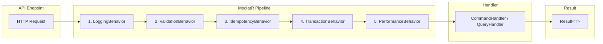

### 5.2 Pipeline Behaviors

| # | Behavior | Applies To | Purpose |
|---|---|---|---|
| 1 | **LoggingBehavior** | All | Logs request name, user context, duration |
| 2 | **ValidationBehavior** | All | Runs FluentValidation; short-circuits with `Result.ValidationFailure` |
| 3 | **IdempotencyBehavior** | `IIdempotentRequest` only | Checks `IIdempotencyStore`; returns cached result for duplicate keys |
| 4 | **TransactionBehavior** | Commands only | Wraps handler in DB transaction; rollback on failure |
| 5 | **PerformanceBehavior** | All | Logs warning when request exceeds 500ms |

### 5.3 Result Monad

All handlers return `Result<T>` — never throw exceptions for business logic:

| Variant | HTTP Mapping |
|---|---|
| `Result.Success(value)` | `200 OK` or `201 Created` |
| `Result.Failure("NOT_FOUND", msg)` | `404 Not Found` |
| `Result.ValidationFailure(errors)` | `422 Unprocessable Entity` |
| `Result.Failure(code, msg)` | `400 Bad Request` |

### 5.4 Command & Query Summary

| Module | Commands | Queries |
|---|---|---|
| **Auth** | Register, Login, CreateGuest, ConvertGuest, VerifyEmail, RequestPasswordReset, ResetPassword | — |
| **Products** | Create, Update, UpdateStock, Activate, Deactivate, Delete, AddVariant, RemoveVariant, AddVariantImage, RemoveVariantImage | GetById, GetBySlug, List (paginated + filtered) |
| **Customers** | AddAddress, UpdateAnalyticsConsent | GetById |
| **Cart** | AddItem, UpdateQuantity, RemoveItem, ApplyDiscount, RemoveDiscount, Clear, MergeGuestCart | GetCart |
| **Orders** | Checkout, Cancel, RequestRefund, MarkProcessing, AddInternalNote | GetById, GetByNumber, ListMyOrders, ListAllOrders |
| **Payments** | ProcessWebhook, Capture, Refund | GetById, GetByOrderId |
| **Shipments** | Create, CreateLabel, MarkShipped, MarkDelivered, ProcessWebhook | GetByOrderId, CalculateRates |
| **Promotions** | Create, Deactivate | ValidateCode, ListActive |
| **Returns** | CreateRequest, Approve, Reject, MarkItemsReceived, CompleteReturn, CompleteExchange | GetById, List |
| **Analytics** | CaptureEvent, FlushEvents | GetSummary |
| **VendorSettings** | UpdateBranding, UpdateCheckout, UpdateShipping, ToggleFeatureFlag, ToggleMaintenanceMode | GetSettings |

**Total: ~35 commands, ~15 queries**

### 5.5 Checkout Orchestration Flow

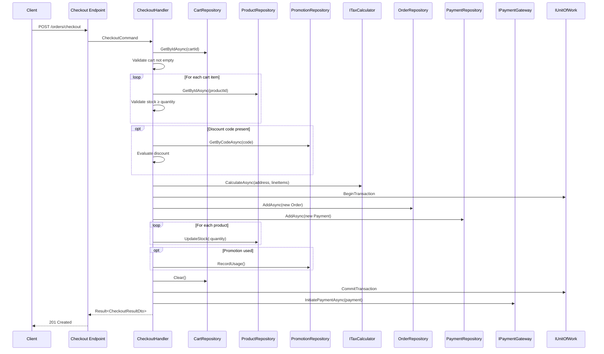

### 5.6 Return/Exchange Flow

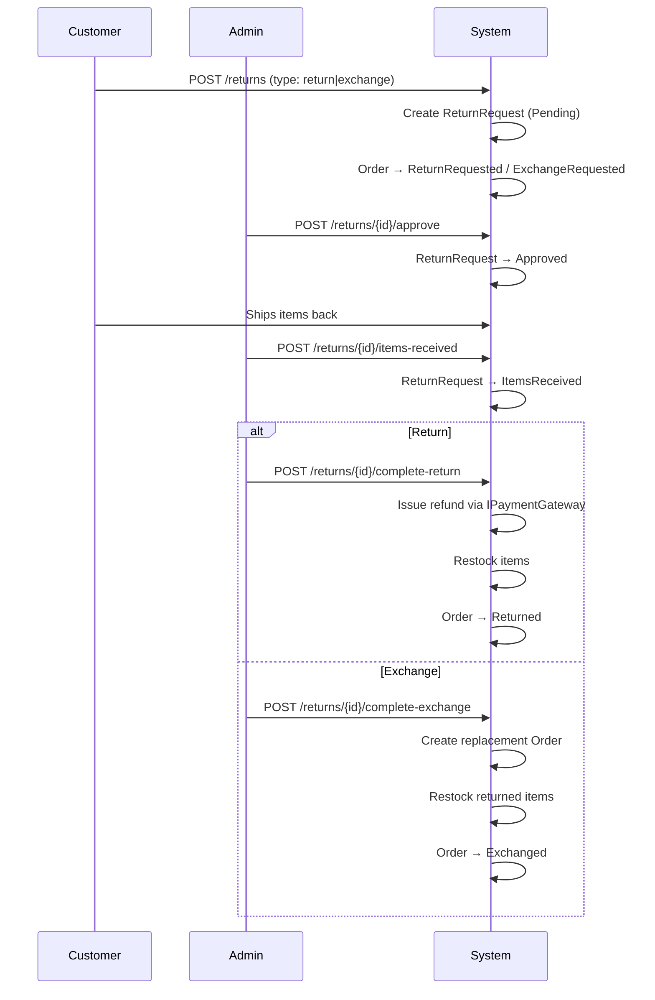

### 5.7 Application-Level Interfaces

| Interface | Purpose |
|---|---|
| `IUnitOfWork` | `SaveChangesAsync`, `BeginTransaction`, `CommitTransaction`, `RollbackTransaction` |
| `IIdempotencyStore` | `ExistsOrCreateAsync`, `GetCachedResponseAsync`, `StoreCachedResponseAsync` |
| `ICacheService` | `GetAsync<T>`, `SetAsync<T>`, `RemoveAsync`, `RemoveByPrefixAsync` |
| `ICurrentUserService` | `CustomerId`, `SessionId`, `IsAuthenticated`, `IsAdmin` |
| `ITokenService` | `GenerateTokens`, `RefreshTokenAsync`, `RevokeRefreshTokenAsync` |
| `IExternalAuthService` | `HandleExternalLoginAsync(provider, idToken)` |
| `IDateTimeProvider` | `UtcNow` — injectable for testing |

---

## 6. Phase D — Infrastructure Layer

### 6.1 Database Schema (EF Core + MSSQL)

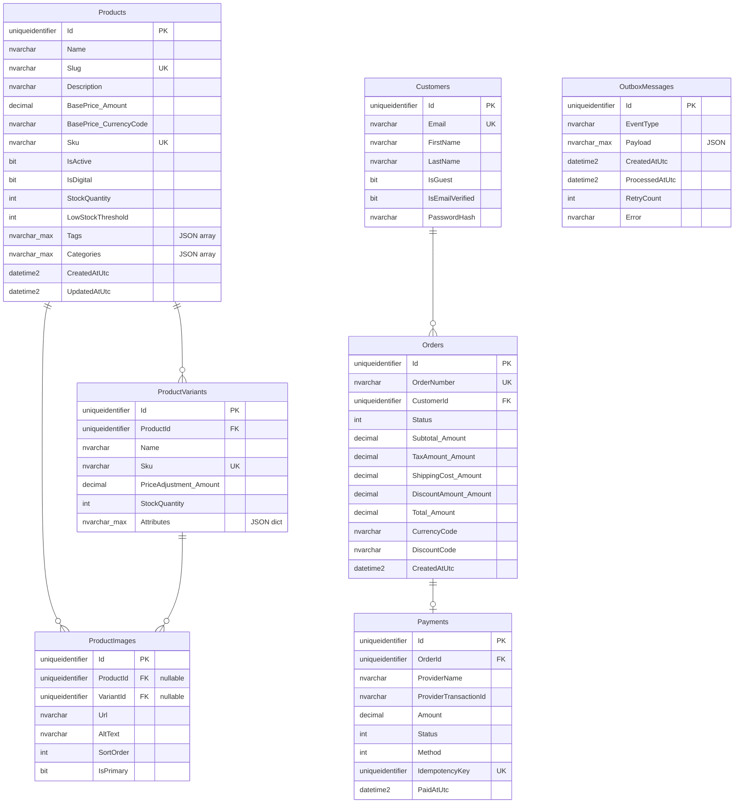

### 6.2 Key MSSQL Decisions

| Aspect | Decision | Rationale |
|---|---|---|
| **Provider** | `Microsoft.EntityFrameworkCore.SqlServer` | User requirement |
| **JSON columns** | `nvarchar(max)` with `JSON_VALUE()` / `OPENJSON()` | SQL Server equivalent of JSONB |
| **Text search** | `EF.Functions.Like()` | Case-insensitive by default in MSSQL |
| **Concurrency** | `EnableRetryOnFailure(maxRetryCount: 3)` | Transient fault handling |
| **Owned types** | `Money`, `Address` → embedded columns | No separate tables for value objects |
| **Soft delete** | `IsDeleted` flag + query filter | Products, Customers |
| **Indexes** | Unique on `Slug`, `Sku`, `Email`, `OrderNumber`; filtered index on `IsActive` | Query performance |

### 6.3 Transactional Outbox Pattern

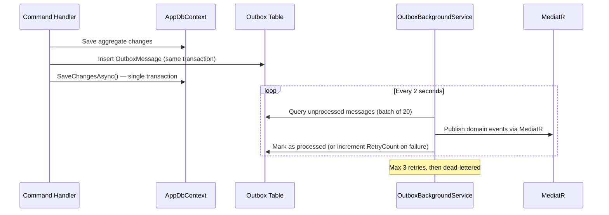

### 6.4 Payment Gateway Architecture

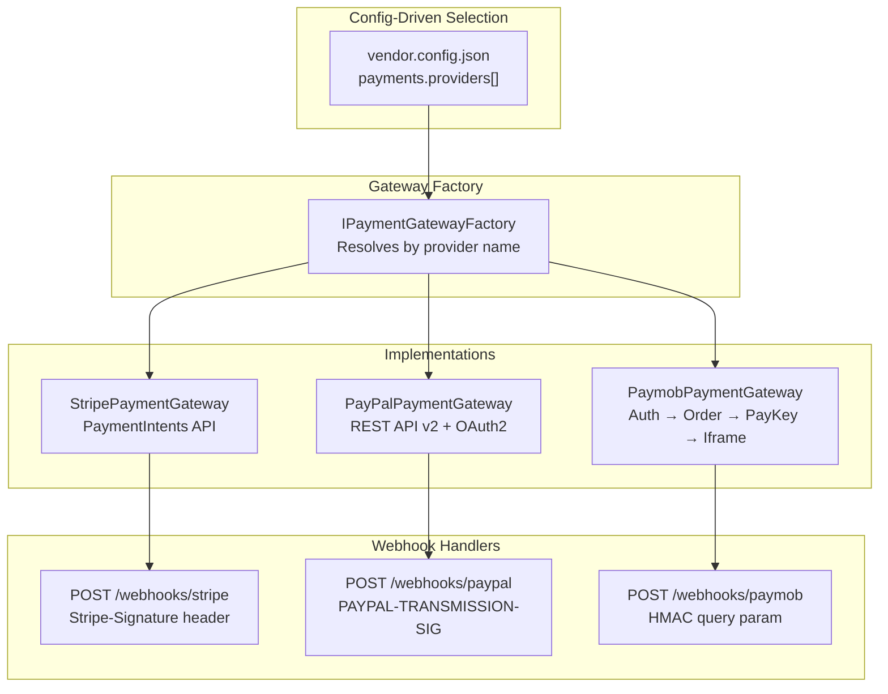

| Provider | Auth | Payment Flow | Webhook Validation |
|---|---|---|---|
| **Stripe** | Secret key (header) | `PaymentIntents.Create()` → `ClientSecret` for frontend | HMAC SHA-256 via `Stripe-Signature` header |
| **PayPal** | OAuth 2.0 client credentials | Create Order → `RedirectUrl` for customer | Verify with PayPal `/verify-webhook-signature` endpoint |
| **Paymob** | API key → auth token | Auth → Register Order → Payment Key → Iframe URL | HMAC SHA-512 of sorted response fields |

All gateways pass `IdempotencyKey` to the provider.

### 6.5 Authentication Architecture

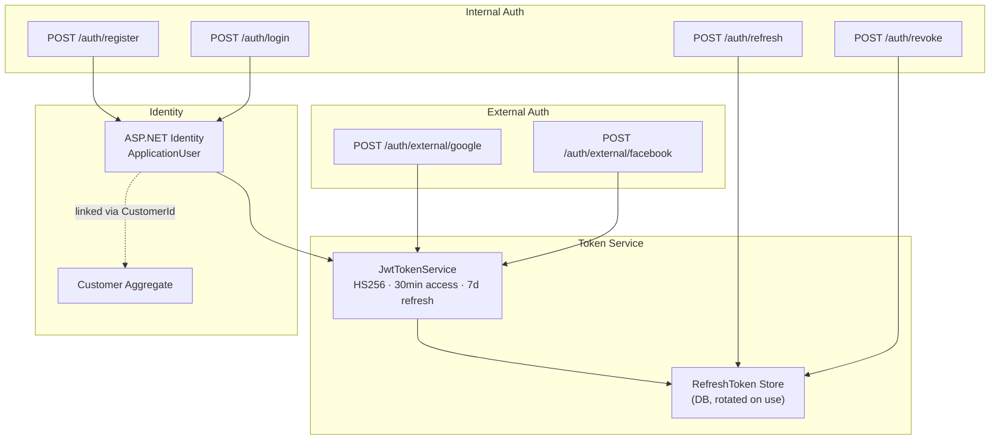

| Aspect | Decision |
|---|---|
| **Access token** | HS256 JWT, 30-minute expiry, contains `CustomerId`, `Email`, `Roles` |
| **Refresh token** | Opaque GUID, 7-day expiry, stored in DB, **rotated on each use** |
| **External auth** | Google: verify via `tokeninfo` endpoint; Facebook: verify via `/me` Graph API |
| **Roles** | `Customer` (default), `Admin` (for dashboard + admin endpoints) |
| **SignalR auth** | JWT passed via `?access_token=` query string |

### 6.6 SignalR Real-Time Architecture

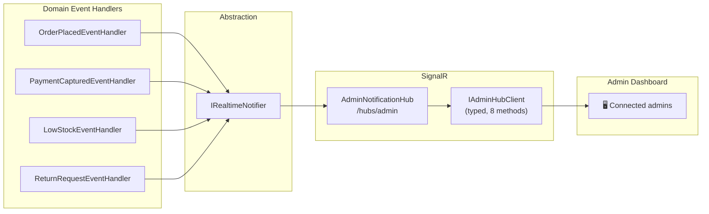

**8 notification methods:** `OnNewOrder`, `OnPaymentReceived`, `OnPaymentFailed`, `OnLowStock`, `OnOrderCancelled`, `OnReturnRequested`, `OnShipmentDelivered`, `OnSettingsUpdated`

**Scaling:** When `caching.provider = "redis"`, the SignalR Redis backplane is automatically enabled for multi-instance deployments.

### 6.7 Caching Architecture

| Config | Implementation | Scope |
|---|---|---|
| `"provider": "memory"` | `InMemoryCacheService` → `IMemoryCache` | Single-instance deployments |
| `"provider": "redis"` | `RedisCacheService` → `IDistributedCache` | Multi-instance + SignalR backplane |

**Cached queries:** Product listing, product by slug, active promotions, shipping rates
**Cache invalidation:** Triggered by domain event handlers on product/promotion mutations

### 6.8 Email Architecture

| Config | Implementation | Package |
|---|---|---|
| `"provider": "sendgrid"` | `SendGridEmailSender` | `SendGrid` NuGet |
| `"provider": "smtp"` | `SmtpEmailSender` | `MailKit` NuGet |

**Email types:** Order confirmation, shipping update, password reset, email verification

### 6.9 Analytics Pipeline

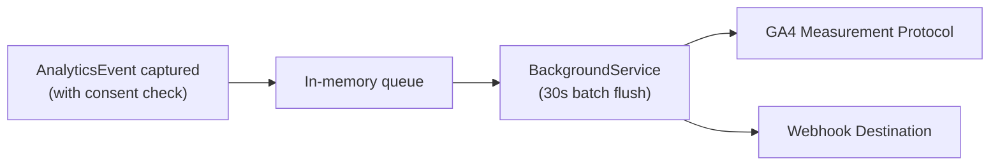

Events are only captured if the customer's consent snapshot permits it. Server-side forwarding destinations are configured in `vendor.config.json`.

---

## 7. Phase E — API Layer

### 7.1 Program.cs Composition Root

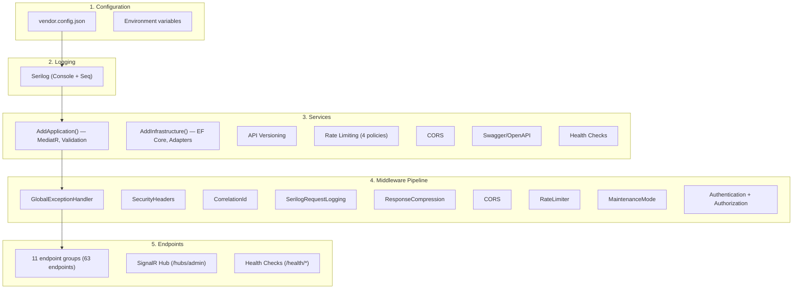

### 7.2 Middleware Pipeline (Order Matters)

| # | Middleware | Purpose |
|---|---|---|
| 1 | `GlobalExceptionHandlerMiddleware` | Catches all exceptions → `ProblemDetails` (400/401/500) |
| 2 | `SecurityHeadersMiddleware` | X-Content-Type-Options, X-Frame-Options, CSP, Referrer-Policy |
| 3 | `CorrelationIdMiddleware` | Propagates/generates `X-Correlation-Id` for request tracing |
| 4 | `SerilogRequestLogging` | Structured request/response logging with correlation ID |
| 5 | `ResponseCompression` | Gzip/Brotli for HTTPS responses |
| 6 | `CORS` | Configured origins with `AllowCredentials` (required for SignalR) |
| 7 | `RateLimiter` | Enforces rate limit policies per endpoint group |
| 8 | `MaintenanceModeMiddleware` | Returns 503 when maintenance mode enabled (skips health + admin) |
| 9 | `Authentication` + `Authorization` | JWT Bearer validation, role-based policies |

### 7.3 Rate Limiting Policies

| Policy | Limit | Window | Applied To |
|---|---|---|---|
| `auth` | 10 requests | 1 minute | Login, register, password reset |
| `catalog` | 300 requests | 1 minute | Public product browsing |
| `default` | 100 requests | 1 minute | All other authenticated endpoints |
| `webhook` | 50 requests | 1 minute | Payment/shipping webhooks |

### 7.4 Complete Endpoint Reference

#### Auth (9 endpoints)

| Method | Route | Auth | Description |
|---|---|---|---|
| `POST` | `/auth/register` | — | Register customer |
| `POST` | `/auth/login` | — | Email/password login |
| `POST` | `/auth/guest` | — | Create guest session |
| `POST` | `/auth/refresh` | — | Refresh JWT |
| `POST` | `/auth/revoke` | JWT | Revoke refresh token |
| `POST` | `/auth/external/{provider}` | — | Google/Facebook OAuth |
| `POST` | `/auth/forgot-password` | — | Request password reset |
| `POST` | `/auth/reset-password` | — | Reset password |
| `POST` | `/auth/verify-email` | JWT | Verify email address |

#### Products (13 endpoints)

| Method | Route | Auth | Description |
|---|---|---|---|
| `GET` | `/products` | — | List/search/filter (paginated, cached) |
| `GET` | `/products/{id}` | — | Get by ID |
| `GET` | `/products/slug/{slug}` | — | Get by slug |
| `POST` | `/products` | Admin | Create product |
| `PUT` | `/products/{id}` | Admin | Update product |
| `PATCH` | `/products/{id}/stock` | Admin | Adjust stock |
| `POST` | `/products/{id}/activate` | Admin | Activate |
| `POST` | `/products/{id}/deactivate` | Admin | Deactivate |
| `DELETE` | `/products/{id}` | Admin | Soft-delete |
| `POST` | `/products/{id}/variants` | Admin | Add variant |
| `DELETE` | `/products/{pid}/variants/{vid}` | Admin | Remove variant |
| `POST` | `/products/{pid}/variants/{vid}/images` | Admin | Add variant image |
| `DELETE` | `/products/{pid}/variants/{vid}/images` | Admin | Remove variant image |

#### Cart (7 endpoints)

| Method | Route | Auth | Description |
|---|---|---|---|
| `GET` | `/cart` | — | Get cart (by cartId or sessionId) |
| `POST` | `/cart/items` | — | Add item |
| `PUT` | `/cart/items/{itemId}` | — | Update quantity |
| `DELETE` | `/cart/{cartId}/items/{itemId}` | — | Remove item |
| `POST` | `/cart/{cartId}/discount` | — | Apply discount code |
| `DELETE` | `/cart/{cartId}/discount` | — | Remove discount |
| `POST` | `/cart/merge` | JWT | Merge guest cart into customer cart |

#### Orders (9 endpoints)

| Method | Route | Auth | Description |
|---|---|---|---|
| `POST` | `/orders/checkout` | JWT | Place order + initiate payment |
| `GET` | `/orders/my` | JWT | Customer's order history (paginated) |
| `GET` | `/orders/{id}` | JWT | Get order by ID |
| `GET` | `/orders/number/{num}` | JWT | Get order by number |
| `POST` | `/orders/{id}/cancel` | JWT | Cancel order |
| `POST` | `/orders/{id}/refund` | JWT | Request refund |
| `GET` | `/orders` | Admin | List all orders (filtered, paginated) |
| `POST` | `/orders/{id}/processing` | Admin | Mark as processing |
| `POST` | `/orders/{id}/notes` | Admin | Add internal note |

#### Payments & Webhooks (4 + 4 endpoints)

| Method | Route | Auth | Description |
|---|---|---|---|
| `GET` | `/payments/{id}` | JWT | Get payment |
| `GET` | `/payments/order/{orderId}` | JWT | Get payment by order |
| `POST` | `/payments/{id}/capture` | Admin | Manual capture |
| `POST` | `/payments/{id}/refund` | Admin | Process refund |
| `POST` | `/webhooks/stripe` | — | Stripe callback (signature validated) |
| `POST` | `/webhooks/paypal` | — | PayPal callback (signature validated) |
| `POST` | `/webhooks/paymob` | — | Paymob callback (HMAC validated) |
| `POST` | `/webhooks/shipping/{provider}` | — | Shipping status callback |

#### Shipments (6 endpoints)

| Method | Route | Auth | Description |
|---|---|---|---|
| `POST` | `/shipments/rates` | — | Calculate shipping rates |
| `GET` | `/shipments/order/{orderId}` | JWT | Track shipment |
| `POST` | `/shipments` | Admin | Create shipment |
| `POST` | `/shipments/{id}/label` | Admin | Create shipping label |
| `POST` | `/shipments/{id}/ship` | Admin | Mark shipped |
| `POST` | `/shipments/{id}/deliver` | Admin | Mark delivered |

#### Returns (8 endpoints)

| Method | Route | Auth | Description |
|---|---|---|---|
| `POST` | `/returns` | JWT | Submit return/exchange request |
| `GET` | `/returns/{id}` | JWT | Get return request |
| `GET` | `/returns` | Admin | List all return requests |
| `POST` | `/returns/{id}/approve` | Admin | Approve return |
| `POST` | `/returns/{id}/reject` | Admin | Reject return |
| `POST` | `/returns/{id}/items-received` | Admin | Mark items received |
| `POST` | `/returns/{id}/complete-return` | Admin | Complete return (issue refund) |
| `POST` | `/returns/{id}/complete-exchange` | Admin | Complete exchange (create replacement order) |

#### Promotions (4 endpoints)

| Method | Route | Auth | Description |
|---|---|---|---|
| `GET` | `/promotions/validate` | — | Validate discount code |
| `POST` | `/promotions` | Admin | Create promotion |
| `GET` | `/promotions` | Admin | List promotions |
| `POST` | `/promotions/{id}/deactivate` | Admin | Deactivate promotion |

#### Analytics, Settings, Customers (8 endpoints)

| Method | Route | Auth | Description |
|---|---|---|---|
| `GET` | `/analytics/summary` | Admin | Event summary dashboard data |
| `GET` | `/admin/settings` | Admin | Get all vendor settings |
| `PUT` | `/admin/settings/branding` | Admin | Update branding |
| `PUT` | `/admin/settings/checkout` | Admin | Update checkout config |
| `PUT` | `/admin/settings/shipping` | Admin | Update shipping config |
| `POST` | `/admin/settings/feature-flags` | Admin | Toggle feature flag |
| `POST` | `/admin/settings/maintenance` | Admin | Toggle maintenance mode |
| `GET` | `/customers/me` | JWT | Get current customer profile |
| `POST` | `/customers/me/addresses` | JWT | Add address |
| `PUT` | `/customers/me/consent` | JWT | Update analytics consent |
| `POST` | `/customers/me/convert` | JWT | Convert guest to registered |

#### Infrastructure Endpoints

| Route | Auth | Description |
|---|---|---|
| `/health/live` | — | Liveness probe (always 200 if running) |
| `/health/ready` | — | Readiness probe (checks MSSQL, Redis, payment providers) |
| `/hubs/admin` | Admin | SignalR WebSocket hub for real-time notifications |

**Total: 63 API endpoints + 1 SignalR hub + 2 health checks**

### 7.5 API Versioning

- Strategy: URL-based (`/api/v1/...`)
- Default version: `v1.0`
- Reports available versions via response headers

---

## 8. Phase F — Testing & CI/CD

### 8.1 Test Strategy

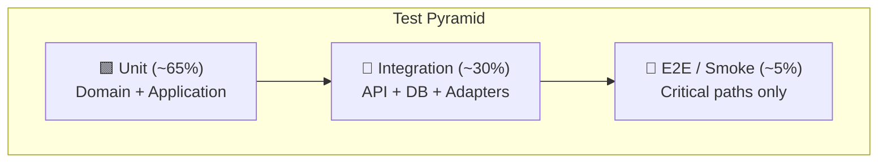

| Layer | Target Coverage | Framework | Techniques |
|---|---|---|---|
| **Domain** | 90% | xUnit + FluentAssertions | Pure unit tests: aggregate invariants, state machine transitions, value object rules |
| **Application** | 85% | xUnit + Moq + FluentAssertions | Handler tests with mocked repos, pipeline behavior tests |
| **Infrastructure** | 70% | xUnit + Testcontainers (MSSQL) + Respawn | Real DB integration, repository correctness, outbox tests |
| **API** | 75% | xUnit + `WebApplicationFactory` | Full HTTP pipeline: endpoints, middleware, auth, rate limiting |

### 8.2 Test Project Structure

```
tests/
├── Vendor.Domain.Tests/
│   ├── Products/                       # ProductTests, ProductVariantTests
│   ├── Orders/                         # OrderTests, OrderStateTransitionTests
│   ├── Payments/                       # PaymentTests
│   ├── Returns/                        # ReturnRequestTests
│   ├── Promotions/                     # PromotionTests
│   └── ValueObjects/                   # MoneyTests, SlugTests, DateRangeTests
│
├── Vendor.Application.Tests/
│   ├── Products/                       # CreateProductCommandTests + Validator
│   ├── Orders/                         # CheckoutCommandTests + Validator
│   ├── Payments/                       # ProcessPaymentWebhookTests
│   ├── Returns/                        # CreateReturnRequestTests
│   └── Behaviors/                      # ValidationBehavior, IdempotencyBehavior tests
│
├── Vendor.Infrastructure.Tests/
│   ├── Persistence/                    # Repository tests, OutboxTests
│   ├── Payments/                       # Gateway adapter tests
│   └── Auth/                           # JwtTokenServiceTests
│
└── Vendor.Api.Tests/
    ├── Endpoints/                      # Auth, Product, Cart, Order, Webhook endpoint tests
    └── Middleware/                      # MaintenanceMode, GlobalExceptionHandler tests
```

### 8.3 Key Testing Patterns

| Pattern | Purpose |
|---|---|
| **Testcontainers (MSSQL)** | Spins up real SQL Server container per test class for integration tests |
| **Respawn** | Resets database state between tests without dropping/recreating schema |
| **WebApplicationFactory** | Full ASP.NET pipeline for endpoint-level integration tests |
| **Bogus** | Generates realistic test data (addresses, names, emails) |
| **AuthHelper** | Utility to generate admin/customer JWT tokens for authenticated endpoint tests |

### 8.4 CI/CD Pipeline (GitHub Actions)

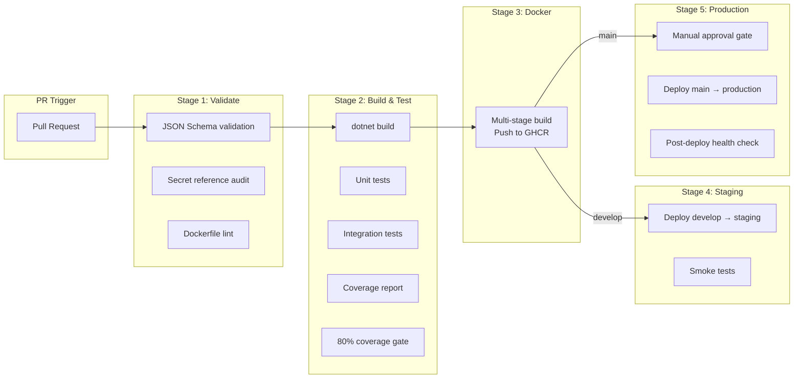

| Stage | Trigger | Key Actions |
|---|---|---|
| **1. Validate** | Every PR | JSON Schema + secret audit + Dockerfile lint |
| **2. Build & Test** | After validation | `dotnet build` + 4 test projects + coverage ≥ 80% |
| **3. Docker** | After tests pass | Multi-stage Dockerfile → push `ghcr.io` |
| **4. Staging** | `develop` merge | Deploy + smoke test (`/health/ready`, `/products`) |
| **5. Production** | `main` merge | Manual approval → deploy + health check |

### 8.5 Docker Architecture

```
┌─────────────────────────────────┐
│  Build Stage (SDK image)        │
│  dotnet restore → build → pub   │
└─────────────┬───────────────────┘
              │
┌─────────────▼───────────────────┐
│  Runtime Stage (ASP.NET image)  │
│  Non-root user (appuser)        │
│  Port 8080                      │
│  HEALTHCHECK on /health/live    │
│  Volume mounts:                 │
│    /app/config  (vendor.config) │
│    /app/theme   (theme assets)  │
└─────────────────────────────────┘
```

---

## 9. Phase G — Execution Roadmap

### 9.1 Sprint Plan (5 Sprints × 2 Weeks = 10 Weeks)

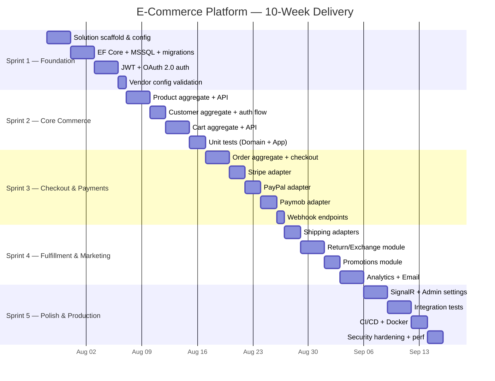

### 9.2 Sprint Deliverables & Exit Criteria

| Sprint | Focus | Key Deliverables | Exit Criteria |
|---|---|---|---|
| **1** (W1-2) | Foundation | Solution scaffold, EF Core + MSSQL, JWT + OAuth 2.0, config validation, base middleware | API boots, authenticates users, validates config, connects to MSSQL |
| **2** (W3-4) | Core Commerce | Product aggregate + API, Customer + auth, Cart + API, domain/app unit tests | Catalog browsable, cart functional, auth complete, 90% domain coverage |
| **3** (W5-6) | Checkout & Payments | Order aggregate, checkout orchestrator, Stripe/PayPal/Paymob adapters, webhooks, idempotency | Full checkout flow with all 3 providers; idempotency works |
| **4** (W7-8) | Fulfillment & Marketing | Shipping adapters, return/exchange module, promotions, analytics, email | Full order lifecycle; promo discounts work; emails sent |
| **5** (W9-10) | Polish & Production | SignalR, admin settings, cache, rate limiting, integration tests, CI/CD, security, perf | Production-ready; CI green; Docker deployable; P95 < 200ms catalog |

### 9.3 Risk Register

| Risk | Impact | Probability | Mitigation |
|---|---|---|---|
| Paymob API undocumented behavior | High | Medium | Build against sandbox first; comprehensive error logging; contact support early |
| EF Core perf on complex queries | Medium | Medium | Split queries, compiled queries for hot paths, early indexing |
| SignalR scaling issues | Medium | Low | Redis backplane configured from Sprint 5; tested before production |
| Payment webhook delivery failures | High | Low | Idempotent handlers; outbox retry with dead-letter logging |
| Config schema drift | Medium | Medium | Auto-generate JSON Schema from C# model in CI |
| MSSQL connection pool exhaustion | Medium | Low | Configure `Max Pool Size`; health check monitoring |

### 9.4 Post-v1 Backlog

| Priority | Feature |
|---|---|
| 🔴 **High** | Multi-currency support (live exchange rates) |
| 🔴 **High** | Admin dashboard frontend (React/Next.js) |
| 🔴 **High** | Vault / AWS SSM secret resolver implementations |
| 🟡 **Medium** | Product reviews + ratings |
| 🟡 **Medium** | Wishlist functionality |
| 🟡 **Medium** | Avalara / TaxJar tax adapter implementations |
| 🟡 **Medium** | Full-text search (SQL Server Full-Text Index or Elasticsearch) |
| 🟡 **Medium** | Horizontal scaling load testing (k6 / Locust) |
| 🟡 **Medium** | Customer notification preferences (email/SMS opt-in) |
| 🟢 **Low** | External promotions rules engine integration |
| 🟢 **Low** | Resource-based authorization policies |
| 🟢 **Low** | NSwag OpenAPI client SDK generation |

---

## Core Discipline Verification ✅

Cloning this repository for a new vendor requires modifying **ONLY**:

```
config/vendor.config.json    ← Vendor-specific settings, payment keys, branding
theme/                       ← Logo, favicon, hero images, email templates
```

- ✅ Zero C# code changes
- ✅ Zero manual database migrations (auto-applied on first boot)
- ✅ Zero infrastructure code changes
- ✅ Secret management via environment variables (no secrets in code or config)
