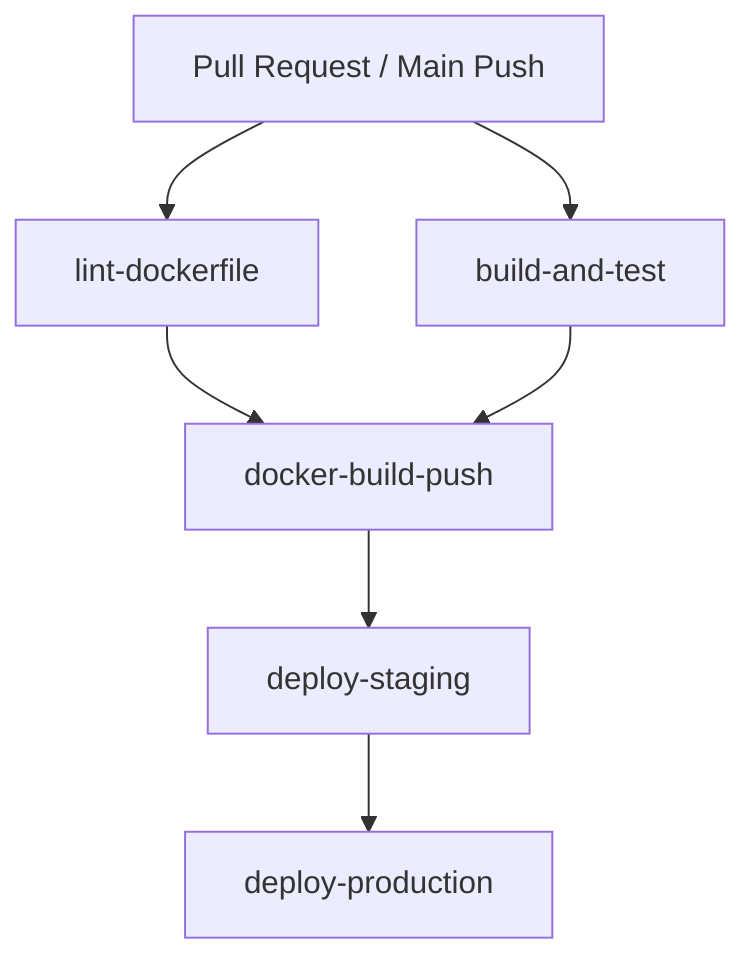

# Phase 4 — CI/CD Pipeline & Production Dockerization Design Document

**Feature**: Phase 4 CI/CD Pipeline & Production Dockerization  
**Date**: 2026-08-03  
**Status**: APPROVED  

---

## 1. Overview

Phase 4 establishes automated continuous integration, Docker containerization, and delivery pipelines for the vendor e-commerce platform. It provides a Hadolint-compliant multi-stage Dockerfile adhering to .NET 9 security best practices and a GitHub Actions workflow with PR quality gates, test execution, container registry publishing, and environment-protected deployment stages.

---

## 2. Component Architecture & Design

### 2.1 Multi-Stage Production `Dockerfile`

The root `Dockerfile` uses a 2-stage build structure:

1. **Build Stage**:
   - Image: `mcr.microsoft.com/dotnet/sdk:9.0`
   - Sets `WORKDIR /src`.
   - Copies `.csproj` files first to maximize layer caching efficiency.
   - Restores dependencies (`dotnet restore`).
   - Copies source code and publishes `src/Vendor.Api/Vendor.Api.csproj` to `/app/publish` using `-c Release --no-restore`.

2. **Runtime Stage**:
   - Image: `mcr.microsoft.com/dotnet/aspnet:9.0`
   - Sets `WORKDIR /app`.
   - Creates and uses non-root user `app` (`USER app`) for container process isolation.
   - Declares `ENV ASPNETCORE_HTTP_PORTS=8080` and `EXPOSE 8080`.
   - Declares persistent volume mount paths: `VOLUME ["/app/config", "/app/theme"]`.
   - Includes health check probe: `HEALTHCHECK --interval=30s --timeout=5s --start-period=10s --retries=3 CMD curl -f http://localhost:8080/health/live || exit 1`.
   - `ENTRYPOINT ["dotnet", "Vendor.Api.dll"]`.

3. **Hadolint Compliance**:
   - Passes all default `hadolint` rules without warnings or errors.

---

### 2.2 GitHub Actions Pipeline (`.github/workflows/ci-cd.yml`)

The workflow triggers on:
- `pull_request` targeting `main` branch.
- `push` to `main` branch.

#### Job Pipeline Breakdown

1. **`lint-dockerfile`**:
   - Runner: `ubuntu-latest`
   - Step: `hadolint/hadolint-action@v3.1.0` targeting `./Dockerfile`.

2. **`build-and-test`**:
   - Runner: `ubuntu-latest`
   - Steps:
     - Checkout repository (`actions/checkout@v4`).
     - Setup .NET 9 SDK (`actions/setup-dotnet@v4`).
     - `dotnet restore Vendor.slnx`
     - `dotnet build Vendor.slnx --no-restore`
     - `dotnet test Vendor.slnx --no-build --verbosity normal`

3. **`docker-build-push`**:
   - Runner: `ubuntu-latest`
   - `needs: [lint-dockerfile, build-and-test]`
   - Steps:
     - Log in to GitHub Container Registry (`ghcr.io`) via `docker/login-action@v3` using `${{ secrets.GITHUB_TOKEN }}`.
     - Set up Docker Buildx (`docker/setup-buildx-action@v3`).
     - Extract metadata/tags via `docker/metadata-action@v5` (tags: `sha-<short_sha>`, `latest` on `main`).
     - Build and push container image via `docker/build-push-action@v5`.

4. **`deploy-staging`**:
   - Runner: `ubuntu-latest`
   - `needs: [docker-build-push]`
   - `environment: staging`
   - Triggers deployment to Staging environment on `main` branch updates.

5. **`deploy-production`**:
   - Runner: `ubuntu-latest`
   - `needs: [deploy-staging]`
   - `environment: production` (requires manual approval in GitHub environment settings).

---

## 3. Verification & Testing Criteria

1. **Hadolint Validation**: `hadolint Dockerfile` returns zero errors.
2. **Local Container Execution**: `docker build -t vendor-api .` succeeds, `docker run -p 8080:8080 vendor-api` boots cleanly, and `curl http://localhost:8080/health/live` returns `200 OK`.
3. **CI/CD Pipeline Validation**: Workflow syntax validated with clean jobs structure.
