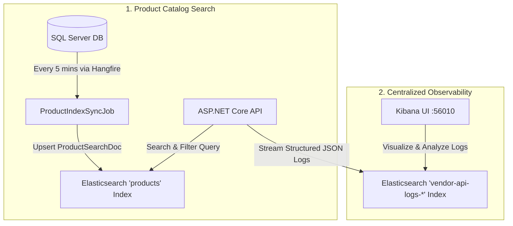

# System Architecture & Elasticsearch Integration

---

### 1. Product Search Engine (`ElasticsearchProductSearchService`)
- **Index**: `products`
- **Model**: `ProductSearchDoc` (`Id`, `Name`, `Slug`, `Description`, `BasePrice`, `Currency`, `Status`, `CreatedAtUtc`)
- **Capabilities**:
  - **Multi-Field Search**: Performs text matching across `Name` and `Description`.
  - **Faceted Filtering**: Filters by status (`Active`) and numeric price ranges (`MinPrice` to `MaxPrice`).
  - **Pagination**: Maps `page` and `pageSize` to Elasticsearch offset `from`/`size` queries.

---

### 2. Automated Catalog Sync (`ProductIndexSyncJob`)
- **Schedule**: Hangfire recurring job running every **5 minutes** (`*/5 * * * *`).
- **Behavior**: Queries active products from SQL Server (`VendorDbContext.Products`) and upserts document snapshots into Elasticsearch.

---

### 3. Centralized Observability (`Serilog` + `Kibana`)
- **Index Pattern**: `vendor-api-logs-{yyyy.MM.dd}`
- **Behavior**: Streams structured JSON logs directly from ASP.NET Core (`Vendor.Api`) to Elasticsearch.
- **Enrichments**: Includes `CorrelationId`, `Environment`, `MachineName`, and `ThreadId`.
- **Dashboard UI**: Kibana running on `http://localhost:56010`.