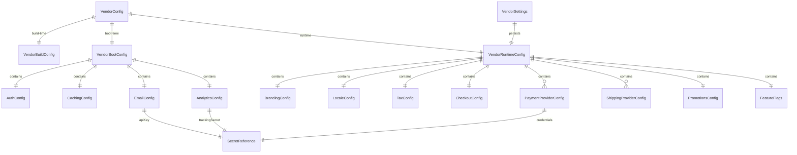

# Data Model: Vendor Configuration System

**Feature**: 001-vendor-config-system
**Date**: 2026-07-25

## Entity Overview

## Domain Layer Entities (Vendor.Domain)

### VendorConfig (Aggregate Root)

Composite root that unifies the three configuration tiers. Lives in Domain layer with zero external dependencies.

| Property | Type | Tier | Mutability |
|----------|------|------|------------|
| `VendorId` | `string` | Build | Immutable after deploy |
| `VendorDisplayName` | `string` | Runtime | Mutable via Admin API |
| `Build` | `VendorBuildConfig` | Build | Immutable |
| `Boot` | `VendorBootConfig` | Boot | Immutable after startup |
| `Runtime` | `VendorRuntimeConfig` | Runtime | Mutable via Admin API |

**Invariants**:
- `VendorId` MUST be non-empty, lowercase alphanumeric with hyphens, max 64 chars.
- `VendorDisplayName` MUST be non-empty, max 128 chars.

### VendorBuildConfig (Value Object)

| Property | Type | Constraints |
|----------|------|-------------|
| `VendorId` | `string` | Required. Pattern: `^[a-z0-9\-]+$`. Max 64 chars. |

### VendorBootConfig (Value Object)

| Property | Type | Constraints |
|----------|------|-------------|
| `Auth` | `AuthConfig` | Required |
| `Caching` | `CachingConfig` | Required |
| `Email` | `EmailConfig` | Required |
| `Analytics` | `AnalyticsConfig` | Required |

### AuthConfig (Value Object)

| Property | Type | Constraints |
|----------|------|-------------|
| `TokenLifetimeMinutes` | `int` | Required. Range: 5–1440 |
| `RefreshTokenLifetimeDays` | `int` | Required. Range: 1–90 |
| `JwtSecret` | `SecretReference` | Required. Must be `ref:*` |
| `GoogleClientId` | `string?` | Optional. Non-empty if provided |
| `GoogleClientSecret` | `SecretReference?` | Optional. Must be `ref:*` if provided |
| `FacebookAppId` | `string?` | Optional. Non-empty if provided |
| `FacebookAppSecret` | `SecretReference?` | Optional. Must be `ref:*` if provided |
| `PasswordMinLength` | `int` | Required. Range: 8–128 |
| `PasswordRequireUppercase` | `bool` | Required |
| `PasswordRequireDigit` | `bool` | Required |
| `PasswordRequireSpecialChar` | `bool` | Required |

### CachingConfig (Value Object)

| Property | Type | Constraints |
|----------|------|-------------|
| `Provider` | `CacheProvider` enum | Required. Values: `Memory`, `Redis` |
| `RedisConnectionString` | `SecretReference?` | Required if Provider = Redis. Must be `ref:*` |
| `KeyPrefix` | `string` | Optional. Default: vendor ID |

### EmailConfig (Value Object)

| Property | Type | Constraints |
|----------|------|-------------|
| `Provider` | `EmailProvider` enum | Required. Values: `SendGrid`, `Smtp` |
| `SenderAddress` | `string` | Required. Must be valid email format |
| `SenderName` | `string` | Required. Max 128 chars |
| `SendGridApiKey` | `SecretReference?` | Required if Provider = SendGrid. Must be `ref:*` |
| `SmtpHost` | `string?` | Required if Provider = Smtp |
| `SmtpPort` | `int?` | Required if Provider = Smtp. Range: 1–65535 |
| `SmtpUsername` | `string?` | Optional |
| `SmtpPassword` | `SecretReference?` | Optional. Must be `ref:*` if provided |
| `TemplateIds` | `Dictionary<string, string>` | Optional. Maps template names to provider template IDs |

### AnalyticsConfig (Value Object)

| Property | Type | Constraints |
|----------|------|-------------|
| `Provider` | `string` | Required. e.g., "ga4", "webhook" |
| `TrackingId` | `string` | Required. Non-empty |
| `ServerSideForwarding` | `bool` | Required |
| `ForwardingSecret` | `SecretReference?` | Required if ServerSideForwarding = true. Must be `ref:*` |
| `ConsentRequired` | `bool` | Required |
| `ConsentCookieName` | `string` | Optional. Default: "analytics_consent" |

### BrandingConfig (Value Object)

| Property | Type | Constraints |
|----------|------|-------------|
| `LogoUrl` | `string` | Required. Must be valid URL |
| `FaviconUrl` | `string?` | Optional. Must be valid URL if provided |
| `PrimaryColor` | `string` | Required. Hex color format: `^#[0-9A-Fa-f]{6}$` |
| `SecondaryColor` | `string` | Required. Hex color format |
| `FontFamily` | `string` | Required. Non-empty |
| `MetaTitle` | `string` | Required. Max 70 chars |
| `MetaDescription` | `string` | Required. Max 160 chars |
| `MetaKeywords` | `string?` | Optional |

### LocaleConfig (Value Object)

| Property | Type | Constraints |
|----------|------|-------------|
| `DefaultLanguage` | `string` | Required. ISO 639-1 code (e.g., "en") |
| `SupportedLanguages` | `string[]` | Required. Non-empty. MUST contain `DefaultLanguage` |
| `DefaultCurrency` | `string` | Required. ISO 4217 code (e.g., "USD") |
| `SupportedCurrencies` | `string[]` | Required. Non-empty. MUST contain `DefaultCurrency` |
| `Timezone` | `string` | Required. IANA timezone (e.g., "America/New_York") |
| `Direction` | `TextDirection` enum | Required. Values: `Ltr`, `Rtl` |

### TaxConfig (Value Object)

| Property | Type | Constraints |
|----------|------|-------------|
| `Strategy` | `TaxStrategy` enum | Required. Values: `Flat`, `TaxJar`, `Avalara`, `None` |
| `FlatRatePercentage` | `decimal?` | Required if Strategy = Flat. Range: 0–100 |
| `PricesIncludeTax` | `bool` | Required |

### CheckoutConfig (Value Object)

| Property | Type | Constraints |
|----------|------|-------------|
| `GuestCheckoutEnabled` | `bool` | Required |
| `MaxItemsPerOrder` | `int` | Required. Range: 1–1000 |
| `OrderNumberPrefix` | `string` | Required. Pattern: `^[A-Z]{2,5}$` |

### PaymentProviderConfig (Entity)

| Property | Type | Constraints |
|----------|------|-------------|
| `ProviderName` | `string` | Required. Values: "stripe", "paypal", "paymob" |
| `Enabled` | `bool` | Required |
| `IsDefault` | `bool` | Required. Exactly ONE provider MUST have `IsDefault = true` |
| `Credentials` | `PaymentCredentials` | Required |
| `SupportedMethods` | `string[]` | Required. Non-empty (e.g., ["card", "apple_pay"]) |
| `CaptureMode` | `CaptureMode` enum | Required. Values: `Automatic`, `Manual` |
| `WebhookSecret` | `SecretReference` | Required. Must be `ref:*` |

### PaymentCredentials (Value Object)

| Property | Type | Constraints |
|----------|------|-------------|
| `PublicKey` | `string` | Required. Non-empty |
| `SecretKey` | `SecretReference` | Required. Must be `ref:*` |

### ShippingProviderConfig (Entity)

| Property | Type | Constraints |
|----------|------|-------------|
| `ProviderName` | `string` | Required. Values: "flat-rate", "shippo" |
| `Enabled` | `bool` | Required |
| `Settings` | `Dictionary<string, object>` | Required. Provider-specific settings |
| `ApiKey` | `SecretReference?` | Required for "shippo". Must be `ref:*` |

### PromotionsConfig (Value Object)

| Property | Type | Constraints |
|----------|------|-------------|
| `Enabled` | `bool` | Required |
| `MaxDiscountCodesPerOrder` | `int` | Required. Range: 1–10 |
| `EvaluationStrategy` | `string` | Required. Values: "first-match", "best-discount", "stack" |
| `AllowStacking` | `bool` | Required |

### FeatureFlags (Value Object)

| Property | Type | Constraints |
|----------|------|-------------|
| `Flags` | `Dictionary<string, bool>` | Required. Non-empty |

Standard flags: `enableReviews`, `enableWishlist`, `enableAnalytics`, `maintenanceMode`, `enablePromotions`.

### SecretReference (Value Object)

| Property | Type | Constraints |
|----------|------|-------------|
| `RawReference` | `string` | Required. Pattern: `^ref:(env|vault|aws-ssm):.+$` |
| `Backend` | `SecretBackend` enum | Derived. Values: `Env`, `Vault`, `AwsSsm` |
| `Path` | `string` | Derived. Everything after the backend prefix |

**Invariants**:
- Construction MUST validate the `ref:*` pattern; invalid format throws `ArgumentException`.
- `ToString()` returns `"ref:***"` (masked) to prevent accidental logging.

## Infrastructure Layer Entities (Vendor.Infrastructure)

### VendorSettings (DB Entity — EF Core)

Persists runtime-tier configuration to MSSQL. Mapped via `IEntityTypeConfiguration<VendorSettings>`.

| Column | SQL Type | Constraints |
|--------|----------|-------------|
| `Id` | `uniqueidentifier` | PK |
| `VendorId` | `nvarchar(64)` | Required. Unique. FK reference key |
| `RuntimeConfigJson` | `nvarchar(max)` | JSON blob of `VendorRuntimeConfig` |
| `Version` | `int` | Optimistic concurrency token |
| `LastModifiedUtc` | `datetime2` | Required. Updated on every write |
| `LastModifiedBy` | `nvarchar(256)` | Required. Admin user ID |

**Notes**:
- `RuntimeConfigJson` stores the full `VendorRuntimeConfig` as JSON. Individual value objects within are NOT mapped as separate EF Core owned types on this table — this table uses a JSON column strategy because the runtime config is treated as a mutable document rather than a set of relational columns.
- Optimistic concurrency: the `Version` column is checked on every `UPDATE`. If a concurrent write incremented it, EF Core throws `DbUpdateConcurrencyException`, which the handler translates to `Result.Failure(ConflictError)`.

## Business Rule Validation Summary

| Rule | Where Enforced | Error |
|------|----------------|-------|
| Exactly 1 payment provider `IsDefault = true` | FluentValidation (boot + runtime) | "Exactly one payment provider must be marked as default" |
| `DefaultCurrency` ∈ `SupportedCurrencies` | FluentValidation (boot + runtime) | "Default currency must be in supported currencies list" |
| `DefaultLanguage` ∈ `SupportedLanguages` | FluentValidation (boot + runtime) | "Default language must be in supported languages list" |
| All secret fields match `^ref:*` | FluentValidation (boot) + CI audit script | "Secret field must use ref:env/ref:vault/ref:aws-ssm format" |
| `RedisConnectionString` required when `CachingProvider = Redis` | FluentValidation (boot) | "Redis connection string required when using Redis provider" |
| `SendGridApiKey` required when `EmailProvider = SendGrid` | FluentValidation (boot) | "SendGrid API key required when using SendGrid provider" |
| `SmtpHost` + `SmtpPort` required when `EmailProvider = Smtp` | FluentValidation (boot) | "SMTP host and port required when using SMTP provider" |

## Enums

| Enum | Values | Layer |
|------|--------|-------|
| `CacheProvider` | `Memory`, `Redis` | Domain |
| `EmailProvider` | `SendGrid`, `Smtp` | Domain |
| `TaxStrategy` | `Flat`, `TaxJar`, `Avalara`, `None` | Domain |
| `TextDirection` | `Ltr`, `Rtl` | Domain |
| `CaptureMode` | `Automatic`, `Manual` | Domain |
| `SecretBackend` | `Env`, `Vault`, `AwsSsm` | Domain |
