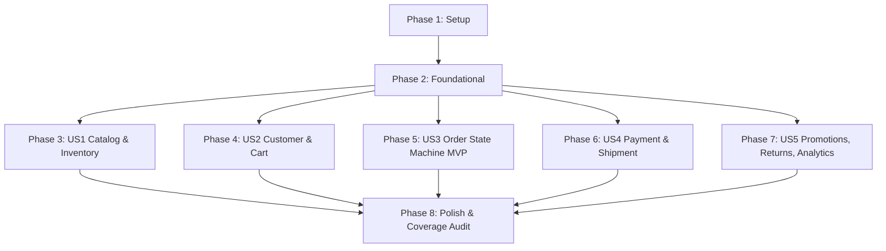

# Tasks: Core Domain Layer Aggregates

**Input**: Design documents from `/specs/002-domain-layer-aggregates/`  
**Prerequisites**: plan.md, spec.md, research.md, data-model.md, contracts/, quickstart.md  
**Tests**: Unit tests included per 90% domain coverage target in constitution and spec.md  
**Organization**: Tasks are grouped by user story to enable independent implementation and testing.

## Format: `[ID] [P?] [Story] Description`

- **[P]**: Can run in parallel (different files, no dependencies)
- **[Story]**: Which user story this task belongs to (e.g., US1, US2, US3, US4, US5)
- Include exact file paths in descriptions

---

## Phase 1: Setup (Shared Infrastructure)

**Purpose**: Project initialization and verifying zero-dependency constraint for `Vendor.Domain`

- [x] T001 Verify `src/Vendor.Domain/Vendor.Domain.csproj` targets `net9.0` with zero external NuGet package dependencies
- [x] T002 [P] Verify `tests/Vendor.Domain.Tests/Vendor.Domain.Tests.csproj` is configured with xUnit and references `Vendor.Domain`

---

## Phase 2: Foundational (Blocking Prerequisites)

**Purpose**: Core abstractions, base entity/aggregate types, domain exceptions, and value objects that ALL aggregate roots depend on

**⚠️ CRITICAL**: No user story implementation can begin until this phase is complete

- [x] T003 [P] Implement `IDomainEvent` marker interface and `DomainEvent` base record in `src/Vendor.Domain/Abstractions/IDomainEvent.cs`
- [x] T004 [P] Implement `Entity<TId>` abstract class in `src/Vendor.Domain/Abstractions/Entity.cs`
- [x] T005 Implement `AggregateRoot<TId>` abstract class with `_domainEvents` list and `RaiseDomainEvent` method in `src/Vendor.Domain/Abstractions/AggregateRoot.cs`
- [x] T006 [P] Implement `DomainException`, `CurrencyMismatchException`, `InvalidStateTransitionException`, and `BusinessRuleViolationException` in `src/Vendor.Domain/Exceptions/DomainExceptions.cs`
- [x] T007 [P] Implement `Money` value object with currency mismatch guard, ISO code normalization, and scalar/arithmetic operators in `src/Vendor.Domain/ValueObjects/Money.cs`
- [x] T008 [P] Implement `Address` value object in `src/Vendor.Domain/ValueObjects/Address.cs`
- [x] T009 [P] Implement `DateRange` value object with `End >= Start` validation and `Contains(DateTime)` method in `src/Vendor.Domain/ValueObjects/DateRange.cs`
- [x] T010 [P] Implement `Slug` value object with `^[a-z0-9\-]+$` regex pattern validation in `src/Vendor.Domain/ValueObjects/Slug.cs`
- [x] T011 [P] Implement `Weight` and `Dimensions` value objects in `src/Vendor.Domain/ValueObjects/WeightAndDimensions.cs`
- [x] T012 [P] Write unit tests for `Money`, `Slug`, and `DateRange` value objects in `tests/Vendor.Domain.Tests/ValueObjects/ValueObjectTests.cs`

**Checkpoint**: Core domain foundation ready — user story aggregate implementation can now begin

---

## Phase 3: User Story 1 - Product & Catalog Management with Inventory Invariants (Priority: P1)

**Goal**: Implement `Product` and `ProductVariant` domain model enforcing activation invariants (price > 0, images >= 1), unique SKU per product, non-negative stock, and `ProductLowStockEvent` threshold notification.

**Independent Test**: Create products, attach variants and images, attempt activation under valid vs invalid conditions, deduct stock past threshold, and assert low-stock event generation.

- [x] T013 [P] [US1] Implement strongly-typed `ProductId` and `ProductVariantId` structs in `src/Vendor.Domain/Aggregates/Product/ProductIds.cs`
- [x] T014 [P] [US1] Implement `ProductActivatedEvent`, `ProductDeactivatedEvent`, and `ProductLowStockEvent` in `src/Vendor.Domain/Events/ProductEvents.cs`
- [x] T015 [P] [US1] Implement `ProductVariant` entity with stock deduction and low-stock threshold evaluation in `src/Vendor.Domain/Aggregates/Product/ProductVariant.cs`
- [x] T016 [US1] Implement `Product` aggregate root with activation rules, SKU uniqueness guard, and variant management in `src/Vendor.Domain/Aggregates/Product/Product.cs`
- [x] T017 [P] [US1] Declare `IProductRepository` interface in `src/Vendor.Domain/Interfaces/Repositories/IProductRepository.cs`
- [x] T018 [US1] Write unit tests for `Product` activation guards, duplicate SKU rejection, and `ProductLowStockEvent` in `tests/Vendor.Domain.Tests/Aggregates/ProductTests.cs`

**Checkpoint**: User Story 1 (Catalog & Inventory) complete and testable independently

---

## Phase 4: User Story 2 - Cart Management & Guest-to-Customer Merge (Priority: P1)

**Goal**: Implement `Customer` and `Cart` aggregate roots supporting max item limits, single discount code application/replacement, cart abandonment predicate/event, and guest cart merge into customer account on login.

**Independent Test**: Create guest carts, add items up to capacity, apply/remove coupon codes, evaluate abandonment timeout predicate, and merge guest cart into customer cart.

- [x] T019 [P] [US2] Implement strongly-typed `CustomerId` and `CartId` structs in `src/Vendor.Domain/Aggregates/Customer/CustomerId.cs` and `src/Vendor.Domain/Aggregates/Cart/CartId.cs`
- [x] T020 [P] [US2] Implement `CustomerCreatedEvent`, `CustomerConsentUpdatedEvent`, and `CartAbandonedEvent` in `src/Vendor.Domain/Events/CustomerAndCartEvents.cs`
- [x] T021 [P] [US2] Implement `Customer` aggregate root with guest-to-registered conversion and analytics consent tracking in `src/Vendor.Domain/Aggregates/Customer/Customer.cs`
- [x] T022 [P] [US2] Implement `CartItem` entity in `src/Vendor.Domain/Aggregates/Cart/CartItem.cs`
- [x] T023 [US2] Implement `Cart` aggregate root with item capacity limit, discount code replacement, abandonment predicate (`IsAbandoned`), and guest cart merge in `src/Vendor.Domain/Aggregates/Cart/Cart.cs`
- [x] T024 [P] [US2] Declare `ICustomerRepository` and `ICartRepository` interfaces in `src/Vendor.Domain/Interfaces/Repositories/ICustomerRepository.cs` and `src/Vendor.Domain/Interfaces/Repositories/ICartRepository.cs`
- [x] T025 [US2] Write unit tests for `Customer` conversion/consent and `Cart` item limits, discount toggle, merge, and abandonment in `tests/Vendor.Domain.Tests/Aggregates/CustomerAndCartTests.cs`

**Checkpoint**: User Story 2 (Customer & Cart) complete and testable independently

---

## Phase 5: User Story 3 - Order Lifecycle State Machine & Financial Invariants (Priority: P1) 🎯 MVP

**Goal**: Implement `Order` aggregate root enforcing strict state machine transitions (`Pending` -> `Confirmed` -> `Processing` -> `Shipped` -> `Delivered` with `Cancelled`, `RefundRequested`/`Refunded`, `ReturnRequested`/`ExchangeRequested` side paths), immutable order lines, and non-negative financial balance formula (`Total = Subtotal + Tax + ShippingCost - Discount >= 0`).

**Independent Test**: Construct orders, perform valid and illegal state machine transitions, verify `OrderPlacedEvent` through `OrderDeliveredEvent` raises, and assert financial math invariants.

- [x] T026 [P] [US3] Implement strongly-typed `OrderId` struct and `OrderStatus` enum in `src/Vendor.Domain/Aggregates/Order/OrderIdAndStatus.cs`
- [x] T027 [P] [US3] Implement `OrderPlacedEvent`, `OrderConfirmedEvent`, `OrderShippedEvent`, `OrderDeliveredEvent`, `OrderCancelledEvent`, and `OrderRefundRequestedEvent` in `src/Vendor.Domain/Events/OrderEvents.cs`
- [x] T028 [P] [US3] Implement immutable `OrderLine` entity in `src/Vendor.Domain/Aggregates/Order/OrderLine.cs`
- [x] T029 [US3] Implement `Order` aggregate root with static `AllowedTransitions` matrix, intention-revealing transition methods, and financial balance validation in `src/Vendor.Domain/Aggregates/Order/Order.cs`
- [x] T030 [P] [US3] Declare `IOrderRepository` and `ITaxCalculator` interfaces in `src/Vendor.Domain/Interfaces/Repositories/IOrderRepository.cs` and `src/Vendor.Domain/Interfaces/Adapters/ITaxCalculator.cs`
- [x] T031 [US3] Write unit tests for `Order` state transitions, immutable lines, and financial calculation invariants in `tests/Vendor.Domain.Tests/Aggregates/OrderTests.cs`

**Checkpoint**: User Story 3 (Order State Machine & MVP) complete and testable independently

---

## Phase 6: User Story 4 - Payment Capture, Refund Protection & Shipment Progression (Priority: P2)

**Goal**: Implement `Payment` and `Shipment` aggregate roots protecting against double-charging via idempotency keys, preventing over-refunding (cumulative refunds <= captured amount), and enforcing linear shipment status progression (tracking assigned only on label creation).

**Independent Test**: Process payments with idempotency keys, execute partial and full refunds up to captured amount, verify over-refund rejection, and progress shipment status from `Pending` through `Delivered`.

- [x] T032 [P] [US4] Implement strongly-typed `PaymentId` and `ShipmentId` structs in `src/Vendor.Domain/Aggregates/Payment/PaymentId.cs` and `src/Vendor.Domain/Aggregates/Shipment/ShipmentId.cs`
- [x] T033 [P] [US4] Implement `PaymentCapturedEvent`, `PaymentFailedEvent`, `PaymentRefundedEvent`, `ShipmentInTransitEvent`, and `ShipmentDeliveredEvent` in `src/Vendor.Domain/Events/PaymentAndShipmentEvents.cs`
- [x] T034 [P] [US4] Implement `Payment` aggregate root with idempotency token, capture flow, and refund ceiling validation in `src/Vendor.Domain/Aggregates/Payment/Payment.cs`
- [x] T035 [P] [US4] Implement `Shipment` aggregate root with linear status transitions and label-creation tracking assignment in `src/Vendor.Domain/Aggregates/Shipment/Shipment.cs`
- [x] T036 [P] [US4] Declare `IPaymentRepository`, `IShipmentRepository`, `IPaymentGateway`, and `IShippingProvider` interfaces in `src/Vendor.Domain/Interfaces/Repositories/IPaymentRepository.cs`, `src/Vendor.Domain/Interfaces/Repositories/IShipmentRepository.cs`, `src/Vendor.Domain/Interfaces/Adapters/IPaymentGateway.cs`, and `src/Vendor.Domain/Interfaces/Adapters/IShippingProvider.cs`
- [x] T037 [US4] Write unit tests for `Payment` over-refund prevention/idempotency and `Shipment` tracking number assignment/status progression in `tests/Vendor.Domain.Tests/Aggregates/PaymentAndShipmentTests.cs`

**Checkpoint**: User Story 4 (Payment & Shipment) complete and testable independently

---

## Phase 7: User Story 5 - Promotions, Returns/Exchanges, VendorSettings & Analytics (Priority: P3)

**Goal**: Implement `Promotion`, `ReturnRequest`, and `AnalyticsEvent` aggregate roots supporting usage caps, validity date ranges, refund vs exchange completion branches, and immutable consent-aware telemetry events.

**Independent Test**: Apply promotions up to usage cap, verify auto-deactivation and `PromotionExhaustedEvent`, complete return requests as refund vs exchange, and verify `AnalyticsEvent` immutability and consent snapshots.

- [x] T038 [P] [US5] Implement strongly-typed `PromotionId`, `ReturnRequestId`, and `AnalyticsEventId` structs in `src/Vendor.Domain/Aggregates/Promotion/PromotionId.cs`, `src/Vendor.Domain/Aggregates/ReturnRequest/ReturnRequestId.cs`, and `src/Vendor.Domain/Aggregates/AnalyticsEvent/AnalyticsEventId.cs`
- [x] T039 [P] [US5] Implement `PromotionExhaustedEvent`, `ReturnRequestCreatedEvent`, `ReturnRequestApprovedEvent`, `ReturnCompletedEvent`, `ExchangeCompletedEvent`, and `VendorSettingsUpdatedEvent` in `src/Vendor.Domain/Events/PromotionReturnAnalyticsEvents.cs`
- [x] T040 [P] [US5] Implement `Promotion` aggregate root with validity date range, max usage count, percentage discount cap, and auto-deactivation in `src/Vendor.Domain/Aggregates/Promotion/Promotion.cs`
- [x] T041 [P] [US5] Implement `ReturnItem` entity and `ReturnRequest` aggregate root with refund vs exchange completion branches in `src/Vendor.Domain/Aggregates/ReturnRequest/ReturnRequest.cs`
- [x] T042 [P] [US5] Implement `AnalyticsEvent` aggregate root with immutable payload and consent snapshot at capture in `src/Vendor.Domain/Aggregates/AnalyticsEvent/AnalyticsEvent.cs`
- [x] T043 [P] [US5] Declare `IPromotionRepository`, `IReturnRequestRepository`, `IAnalyticsEventRepository`, `IAnalyticsForwarder`, and `INotificationSender` interfaces in `src/Vendor.Domain/Interfaces/Repositories/IPromotionRepository.cs`, `src/Vendor.Domain/Interfaces/Repositories/IReturnRequestRepository.cs`, `src/Vendor.Domain/Interfaces/Repositories/IAnalyticsEventRepository.cs`, `src/Vendor.Domain/Interfaces/Adapters/IAnalyticsForwarder.cs`, and `src/Vendor.Domain/Interfaces/Adapters/INotificationSender.cs`
- [x] T044 [US5] Write unit tests for `Promotion` usage caps, `ReturnRequest` refund vs exchange divergence, and `AnalyticsEvent` consent snapshots in `tests/Vendor.Domain.Tests/Aggregates/PromotionReturnAnalyticsTests.cs`

**Checkpoint**: All 5 user story phases complete and independently testable

---

## Phase 8: Polish & Cross-Cutting Concerns

**Purpose**: Verify zero-dependency constraint, check line coverage target (≥90%), and run quickstart validation suite

- [x] T045 [P] Audit `src/Vendor.Domain/Vendor.Domain.csproj` to confirm zero external NuGet dependencies exist
- [x] T046 Run full unit test suite and generate coverage report to verify ≥ 90% Domain line coverage threshold
- [x] T047 Execute all 15 validation scenarios from `quickstart.md` and confirm 100% test pass rate

---

## Dependencies & Execution Order

### Phase Dependencies

- **Setup (Phase 1)**: No dependencies — start immediately.
- **Foundational (Phase 2)**: Depends on Setup — **BLOCKS ALL USER STORIES**.
- **User Stories (Phases 3–7)**: Depend on Foundational completion. Stories US1 through US5 are independently testable and can proceed sequentially or in parallel.
- **Polish (Phase 8)**: Depends on all user stories being complete.

---

## Parallel Execution Opportunities

- **Phase 2 Foundational**: T003 (`IDomainEvent`), T004 (`Entity`), T006 (`DomainExceptions`), T007 (`Money`), T008 (`Address`), T009 (`DateRange`), T010 (`Slug`), T011 (`WeightAndDimensions`), T012 (`ValueObjectTests`) can all run concurrently.
- **Phase 3 (US1)**: T013 (`ProductIds`), T014 (`ProductEvents`), T015 (`ProductVariant`), T017 (`IProductRepository`) can run in parallel before T016 (`Product`) and T018 (`ProductTests`).
- **Phase 4 (US2)**: T019 (`CustomerId`/`CartId`), T020 (`Events`), T021 (`Customer`), T022 (`CartItem`), T024 (`Repositories`) can run in parallel before T023 (`Cart`) and T025 (`Tests`).
- **Phase 5 (US3)**: T026 (`OrderId`), T027 (`OrderEvents`), T028 (`OrderLine`), T030 (`Repositories/Adapters`) can run in parallel before T029 (`Order`) and T031 (`OrderTests`).
- **Phase 6 (US4)**: T032 (`PaymentId`/`ShipmentId`), T033 (`Events`), T034 (`Payment`), T035 (`Shipment`), T036 (`Interfaces`) can run in parallel before T037 (`Tests`).
- **Phase 7 (US5)**: T038 (`Ids`), T039 (`Events`), T040 (`Promotion`), T041 (`ReturnRequest`), T042 (`AnalyticsEvent`), T043 (`Interfaces`) can run in parallel before T044 (`Tests`).

---

## Implementation Strategy

### MVP Scope (Phases 1–3 + Phase 5 Order State Machine)
1. Complete Phase 1 (Setup) and Phase 2 (Foundational).
2. Complete Phase 3 (US1 — Product Catalog) and Phase 5 (US3 — Order State Machine MVP).
3. Validate order financial math and state machine transitions.

### Full Incremental Scope (Phases 1–8)
1. Setup + Foundational -> Core domain foundation ready.
2. US1 -> Product catalog & stock inventory invariants.
3. US2 -> Customer & Cart merge/abandonment.
4. US3 -> Order state machine MVP.
5. US4 -> Payment capture/refund protection & Shipment linear progression.
6. US5 -> Promotion usage caps, Return/Exchange branches, Analytics consent snapshots.
7. Polish -> Coverage audit ≥ 90%, zero-dependency check, quickstart validation suite.
