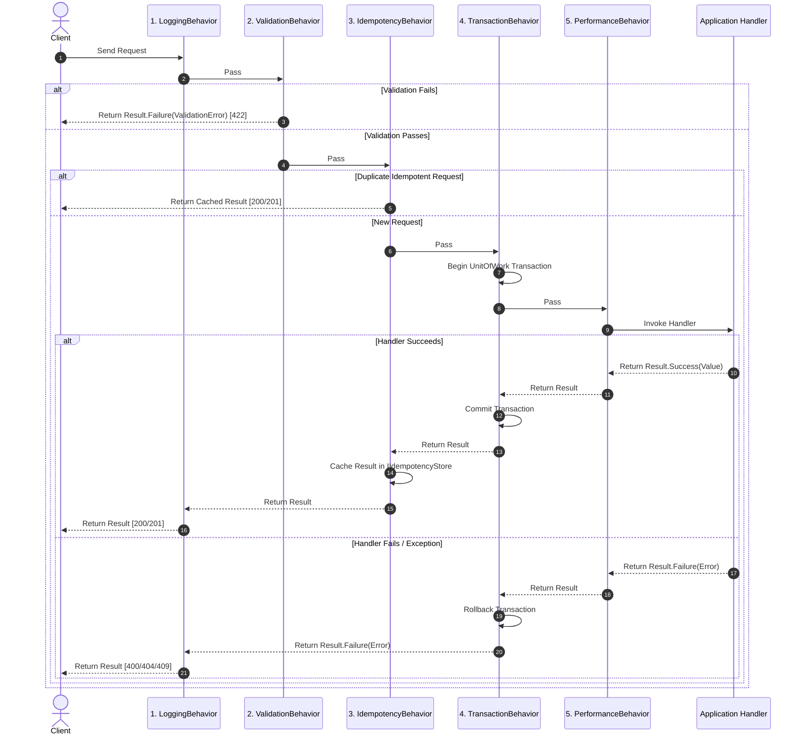

# Contract: Result<T> Taxonomy & Error Mapping

**Feature**: 003-application-layer-cqrs

---

## 1. Result Contract

Every Application handler returns `Task<Result<TResponse>>` (or `Task<Result>` for void commands).

```csharp
public class Result<T>
{
    public bool IsSuccess { get; }
    public bool IsFailure => !IsSuccess;
    public T Value { get; }
    public Error Error { get; }

    public static Result<T> Success(T value) => new(true, value, Error.None);
    public static Result<T> Failure(Error error) => new(false, default!, error);

    public static implicit operator Result<T>(T value) => Success(value);
    public static implicit operator Result<T>(Error error) => Failure(error);
}
```

---

## 2. Error Variant Hierarchy & HTTP Code Mapping

| Error Variant | Properties | Intended HTTP Status | Example Code / Cause |
|---------------|------------|----------------------|----------------------|
| `Error.None` | - | `200 OK` / `201 Created` | Successful execution |
| `NotFoundError` | `EntityName`, `Key` | `404 Not Found` | `Product with key '123' not found.` |
| `ValidationError` | `IDictionary<string, string[]> Errors` | `422 Unprocessable Entity` | Field-level FluentValidation failures |
| `ConflictError` | `Code`, `Message` | `409 Conflict` | Optimistic concurrency mismatch / duplicate key |
| `UnauthorizedError` | `Message` | `401 Unauthorized` | Invalid/expired JWT or invalid credentials |
| `ForbiddenError` | `Message` | `403 Forbidden` | Insufficient role or vendor permissions |
| `Error` (Generic) | `Code`, `Message` | `400 Bad Request` | Domain business rule violation (e.g. `INSUFFICIENT_STOCK`) |

---

## 3. Pipeline Execution & Short-Circuit Rules


