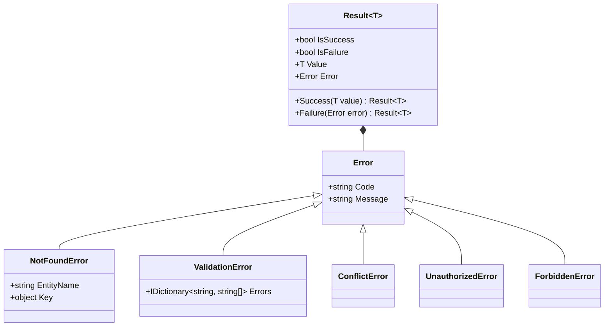

# Data Model & DTO Specifications: Application Layer CQRS

**Feature**: 003-application-layer-cqrs
**Date**: 2026-07-25

> All DTOs and Application types live in `src/Vendor.Application/`.
> DTOs are defined as immutable C# `record` types.
> Entities belong to `Vendor.Domain` (completed in Feature 002).

---

## 1. Result & Error Data Model



### Result Types

#### `Result` (Non-Generic)
| Property | Type | Notes |
|----------|------|-------|
| `IsSuccess` | `bool` | True if operation succeeded |
| `IsFailure` | `bool` | True if operation failed |
| `Error` | `Error` | `Error.None` on success, concrete `Error` on failure |

#### `Result<T>` (Generic)
| Property | Type | Notes |
|----------|------|-------|
| `IsSuccess` | `bool` | True if operation succeeded |
| `IsFailure` | `bool` | True if operation failed |
| `Value` | `T` | Payload (throws `InvalidOperationException` if accessed on failure) |
| `Error` | `Error` | `Error.None` on success, concrete `Error` on failure |

---

## 2. Application Interfaces (7 Core Interfaces)

### `IUnitOfWork`
```csharp
public interface IUnitOfWork
{
    Task BeginTransactionAsync(CancellationToken ct = default);
    Task CommitAsync(CancellationToken ct = default);
    Task RollbackAsync(CancellationToken ct = default);
    Task<int> SaveChangesAsync(CancellationToken ct = default);
}
```

### `IIdempotencyStore`
```csharp
public interface IIdempotencyStore
{
    Task<bool> ExistsAsync(string key, CancellationToken ct = default);
    Task<object?> GetResultAsync(string key, CancellationToken ct = default);
    Task SaveResultAsync(string key, object result, TimeSpan ttl, CancellationToken ct = default);
}
```

### `ICacheService`
```csharp
public interface ICacheService
{
    Task<T?> GetAsync<T>(string key, CancellationToken ct = default);
    Task SetAsync<T>(string key, T value, TimeSpan? expiration = null, CancellationToken ct = default);
    Task RemoveAsync(string key, CancellationToken ct = default);
}
```

### `ICurrentUserService`
```csharp
public interface ICurrentUserService
{
    string? UserId { get; }
    Guid? CustomerId { get; }
    string VendorId { get; }
    bool IsAuthenticated { get; }
    IReadOnlyList<string> Roles { get; }
}
```

### `ITokenService`
```csharp
public record TokenResult(string AccessToken, string RefreshToken, DateTime AccessTokenExpiresAtUtc);

public interface ITokenService
{
    TokenResult GenerateTokens(Guid userId, string email, IEnumerable<string> roles);
    Task<TokenResult> RefreshTokenAsync(string refreshToken, CancellationToken ct = default);
    Task RevokeTokenAsync(string refreshToken, CancellationToken ct = default);
    Task<bool> ValidateTokenAsync(string token, CancellationToken ct = default);
}
```

### `IExternalAuthService`
```csharp
public record ExternalAuthUser(string ProviderId, string Email, string FirstName, string LastName);

public interface IExternalAuthService
{
    Task<ExternalAuthUser?> VerifyGoogleTokenAsync(string idToken, CancellationToken ct = default);
    Task<ExternalAuthUser?> VerifyFacebookTokenAsync(string accessToken, CancellationToken ct = default);
}
```

### `IDateTimeProvider`
```csharp
public interface IDateTimeProvider
{
    DateTime UtcNow { get; }
}
```

---

## 3. Core DTO Specifications

### Auth DTOs
- `AuthResponseDto(string AccessToken, string RefreshToken, DateTime ExpiresAtUtc, CustomerDto User)`
- `CustomerDto(Guid Id, string Email, string FirstName, string LastName, string CustomerType, bool AnalyticsConsent)`

### Product DTOs
- `ProductDto(Guid Id, string Name, string Slug, decimal BasePrice, string Currency, string Status, int LowStockThreshold, IReadOnlyList<ProductVariantDto> Variants, IReadOnlyList<string> Images)`
- `ProductVariantDto(Guid Id, string Sku, decimal PriceAdjustment, int StockQuantity, decimal Weight, string WeightUnit)`

### Cart DTOs
- `CartDto(Guid Id, Guid? CustomerId, string? SessionId, string Status, string? DiscountCode, decimal Subtotal, decimal DiscountAmount, decimal Total, IReadOnlyList<CartItemDto> Items)`
- `CartItemDto(Guid VariantId, string ProductName, string Sku, int Quantity, decimal UnitPrice, decimal LineTotal)`

### Order DTOs
- `OrderDto(Guid Id, string OrderNumber, Guid CustomerId, string Status, AddressDto ShippingAddress, decimal Subtotal, decimal Tax, decimal ShippingCost, decimal Discount, decimal Total, DateTime PlacedAtUtc, IReadOnlyList<OrderLineDto> Lines)`
- `OrderLineDto(Guid VariantId, string ProductName, string Sku, int Quantity, decimal UnitPrice, decimal LineTotal)`
- `AddressDto(string Street, string City, string State, string ZipCode, string CountryCode)`

### Payment & Shipment DTOs
- `PaymentDto(Guid Id, Guid OrderId, string Status, decimal Amount, string Currency, string IdempotencyKey, string? GatewayTransactionId, DateTime? CapturedAtUtc)`
- `ShipmentDto(Guid Id, Guid OrderId, string Status, string? TrackingNumber, string CarrierCode, AddressDto ShippingAddress, DateTime? EstimatedDeliveryUtc)`

### Promotion & Return DTOs
- `PromotionDto(Guid Id, string Code, string DiscountType, decimal DiscountValue, decimal? MaxDiscountAmount, DateTime StartUtc, DateTime EndUtc, int? MaxUsageCount, int CurrentUsageCount, bool IsActive)`
- `ReturnRequestDto(Guid Id, Guid OrderId, Guid CustomerId, string Status, string Reason, string? RequestedResolution, DateTime CreatedAtUtc, IReadOnlyList<ReturnItemDto> Items)`
- `ReturnItemDto(Guid OrderLineId, Guid VariantId, int Quantity, string Reason)`

### Analytics & VendorSettings DTOs
- `AnalyticsEventDto(Guid Id, Guid? CustomerId, string EventType, string Payload, bool ConsentGrantedAtCapture, DateTime OccurredAtUtc)`
- `VendorConfigDto(string VendorId, string VendorDisplayName, object Build, object Boot, object Runtime, int Version, DateTime LastModifiedUtc)`
