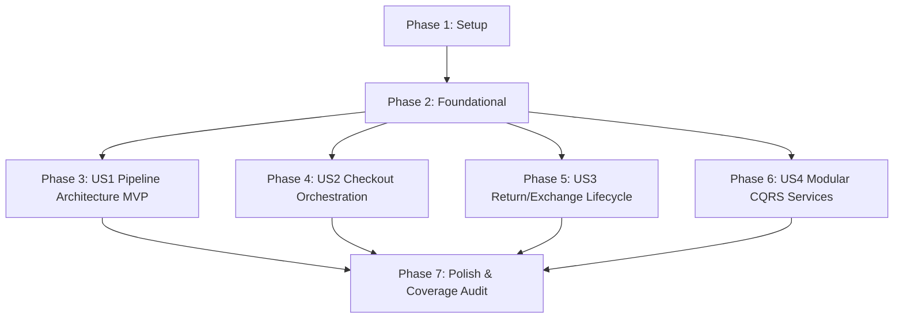

# Tasks: Application Layer CQRS & Pipeline Architecture

**Input**: Design documents from `/specs/003-application-layer-cqrs/`  
**Prerequisites**: plan.md, spec.md, research.md, data-model.md, contracts/, quickstart.md  
**Tests**: Unit tests included per 85% application coverage target in constitution and spec.md  
**Organization**: Tasks are grouped by user story to enable independent implementation and testing.

## Format: `[ID] [P?] [Story] Description`

- **[P]**: Can run in parallel (different files, no dependencies)
- **[Story]**: Which user story this task belongs to (e.g., US1, US2, US3, US4)
- Include exact file paths in descriptions

---

## Phase 1: Setup (Shared Infrastructure)

**Purpose**: Project initialization and package reference configuration for `Vendor.Application`

- [x] T001 Configure `src/Vendor.Application/Vendor.Application.csproj` targeting `net9.0` with MediatR 12.x, FluentValidation 11.x, and `Vendor.Domain` project reference
- [x] T002 [P] Configure `tests/Vendor.Application.Tests/Vendor.Application.Tests.csproj` with xUnit, FluentAssertions, NSubstitute, and reference to `Vendor.Application`

---

## Phase 2: Foundational (Blocking Prerequisites)

**Purpose**: Core `Result<T>` types, `Error` taxonomy, 5-stage MediatR pipeline behaviors, and application interfaces that ALL handlers depend on

**⚠️ CRITICAL**: No user story implementation can begin until this phase is complete

- [x] T003 [P] Implement `Error` base record and variants (`NotFoundError`, `ValidationError`, `ConflictError`, `UnauthorizedError`, `ForbiddenError`) in `src/Vendor.Application/Common/Results/Error.cs`
- [x] T004 [P] Implement `IResult` interface, `Result` struct, and `Result<T>` struct in `src/Vendor.Application/Common/Results/Result.cs`
- [x] T005 [P] Implement `ResultFactory` generic helper and `ResultExtensions` in `src/Vendor.Application/Common/Results/ResultFactory.cs`
- [x] T006 [P] Implement `ICommand`, `IQuery`, and `IIdempotentRequest` marker interfaces in `src/Vendor.Application/Common/Messaging/IMessaging.cs`
- [x] T007 [P] Declare 7 core application interfaces (`IUnitOfWork`, `IIdempotencyStore`, `ICacheService`, `ICurrentUserService`, `ITokenService`, `IExternalAuthService`, `IDateTimeProvider`) in `src/Vendor.Application/Interfaces/IApplicationInterfaces.cs`
- [x] T008 [P] Implement `LoggingBehavior<TRequest, TResponse>` in `src/Vendor.Application/Common/Behaviors/LoggingBehavior.cs`
- [x] T009 [P] Implement `ValidationBehavior<TRequest, TResponse>` in `src/Vendor.Application/Common/Behaviors/ValidationBehavior.cs`
- [x] T010 [P] Implement `IdempotencyBehavior<TRequest, TResponse>` in `src/Vendor.Application/Common/Behaviors/IdempotencyBehavior.cs`
- [x] T011 [P] Implement `TransactionBehavior<TRequest, TResponse>` in `src/Vendor.Application/Common/Behaviors/TransactionBehavior.cs`
- [x] T012 [P] Implement `PerformanceBehavior<TRequest, TResponse>` in `src/Vendor.Application/Common/Behaviors/PerformanceBehavior.cs`
- [x] T013 Register MediatR, FluentValidation, and 5-stage pipeline behaviors in exact execution order in `src/Vendor.Application/DependencyInjection.cs`
- [x] T014 [P] Write unit tests for `Result<T>` taxonomy and 5-stage pipeline behavior chain in `tests/Vendor.Application.Tests/Common/PipelineBehaviorTests.cs`

**Checkpoint**: Core application foundation ready — user story handler implementation can now begin

---

## Phase 3: User Story 1 - Deterministic Command/Query Execution with 5-Stage Pipeline (Priority: P1) 🎯 MVP

**Goal**: Verify deterministic 5-stage pipeline behavior (Logging → Validation → Idempotency → Transaction → Performance), non-throwing `Result<T>` returns, and HTTP status code mapping (200/201, 400, 404, 422).

**Independent Test**: Execute test commands with valid inputs, invalid fields (422), non-existent entity IDs (404), duplicate idempotency keys, and transaction failure rollbacks.

- [x] T015 [P] [US1] Write contract and short-circuit tests for `ValidationBehavior` (422), `IdempotencyBehavior` de-duplication, and `TransactionBehavior` rollback in `tests/Vendor.Application.Tests/Common/PipelineShortCircuitTests.cs`

**Checkpoint**: User Story 1 (Pipeline Architecture & Result<T> MVP) complete and testable independently

---

## Phase 4: User Story 2 - Complete E-Commerce Checkout Orchestration Flow (Priority: P1)

**Goal**: Implement `CheckoutOrderCommand` and handler orchestrating cart validation, line item stock verification, discount evaluation, tax calculation, atomic local DB commit, and payment gateway authorization.

**Independent Test**: Execute checkout against active cart, verify stock check, tax calculation, atomic database commit (Order + Payment + Stock Deduction + Promotion Usage + Cart Clear), and gateway initiation.

- [x] T016 [P] [US2] Create checkout command DTOs (`CheckoutOrderCommand`, `OrderDto`, `OrderLineDto`, `AddressDto`) in `src/Vendor.Application/Modules/Orders/Dtos/CheckoutDtos.cs`
- [x] T017 [P] [US2] Implement `CheckoutOrderCommandValidator` using FluentValidation in `src/Vendor.Application/Modules/Orders/Validators/CheckoutOrderCommandValidator.cs`
- [x] T018 [US2] Implement two-phase atomic `CheckoutOrderCommandHandler` (cart validation -> stock check -> discount -> tax -> local DB commit -> payment gateway call) in `src/Vendor.Application/Modules/Orders/Commands/CheckoutOrderCommandHandler.cs`
- [x] T019 [US2] Write unit tests for `CheckoutOrderCommandHandler` (success, stock failure rollback, payment failure handling) in `tests/Vendor.Application.Tests/Modules/CheckoutOrchestrationTests.cs`

**Checkpoint**: User Story 2 (Checkout Orchestration Flow) complete and testable independently

---

## Phase 5: User Story 3 - Multi-Stage Return and Exchange Lifecycle Flow (Priority: P2)

**Goal**: Implement 5-stage Return/Exchange workflow handlers (`SubmitReturnRequest`, `ApproveReturnRequest`, `MarkReturnItemsReceived`, `CompleteReturnRefund`, `CompleteExchangeReplacement`).

**Independent Test**: Execute submission, administrative approval, receipt confirmation, and final completion for both return (refund + restock) and exchange (replacement order + restock) paths.

- [x] T020 [P] [US3] Create return/exchange DTOs (`ReturnRequestDto`, `ReturnItemDto`) in `src/Vendor.Application/Modules/Returns/Dtos/ReturnDtos.cs`
- [x] T021 [P] [US3] Implement `SubmitReturnRequestCommand` & handler in `src/Vendor.Application/Modules/Returns/Commands/SubmitReturnRequestCommandHandler.cs`
- [x] T022 [P] [US3] Implement `ApproveReturnRequestCommand` & handler in `src/Vendor.Application/Modules/Returns/Commands/ApproveReturnRequestCommandHandler.cs`
- [x] T023 [P] [US3] Implement `MarkReturnItemsReceivedCommand` & handler in `src/Vendor.Application/Modules/Returns/Commands/MarkReturnItemsReceivedCommandHandler.cs`
- [x] T024 [P] [US3] Implement `CompleteReturnRefundCommand` & handler in `src/Vendor.Application/Modules/Returns/Commands/CompleteReturnRefundCommandHandler.cs`
- [x] T025 [P] [US3] Implement `CompleteExchangeReplacementCommand` & handler in `src/Vendor.Application/Modules/Returns/Commands/CompleteExchangeReplacementCommandHandler.cs`
- [x] T026 [US3] Write unit tests for full 5-stage return and exchange lifecycle in `tests/Vendor.Application.Tests/Modules/ReturnWorkflowTests.cs`

**Checkpoint**: User Story 3 (Return & Exchange Lifecycle Flow) complete and testable independently

---

## Phase 6: User Story 4 - Modular CQRS Application Services (Priority: P2)

**Goal**: Implement ~35 commands and ~15 queries organized across 11 domain modules.

**Independent Test**: Execute sample commands and queries across each module to verify handler isolation, DTO mapping, and repository/adapter interaction.

- [x] T027 [P] [US4] Implement Auth module commands (`RegisterCustomer`, `LoginWithPassword`, `LoginWithOAuth`, `RefreshToken`, `RevokeToken`, `ChangePassword`) and queries (`GetCurrentUserProfile`, `ValidateToken`) in `src/Vendor.Application/Modules/Auth/`
- [x] T028 [P] [US4] Implement Product module commands (`CreateProduct`, `UpdateProduct`, `ActivateProduct`, `DeactivateProduct`, `AddProductVariant`, `UpdateProductVariant`, `DeleteProductVariant`, `AddProductImage`, `RemoveProductImage`) and queries (`GetProductById`, `GetProductBySlug`, `SearchProducts`, `GetProductVariants`) in `src/Vendor.Application/Modules/Products/`
- [x] T029 [P] [US4] Implement Customer module commands (`RegisterGuestCustomer`, `ConvertGuestToRegistered`, `UpdateCustomerProfile`, `AddShippingAddress`, `RemoveShippingAddress`, `UpdateAnalyticsConsent`) and queries (`GetCustomerById`, `GetCustomerByEmail`, `GetCustomerOrderHistory`) in `src/Vendor.Application/Modules/Customers/`
- [x] T030 [P] [US4] Implement Cart module commands (`CreateCart`, `AddCartItem`, `UpdateCartItemQuantity`, `RemoveCartItem`, `ApplyCartDiscountCode`, `RemoveCartDiscountCode`, `ClearCart`, `MergeGuestCart`, `ProcessCartAbandonment`) and queries (`GetCartById`, `GetCartByCustomerId`, `GetCartBySessionId`) in `src/Vendor.Application/Modules/Cart/`
- [x] T031 [P] [US4] Implement Order module commands (`PlaceOrder`, `ConfirmOrderPayment`, `StartOrderProcessing`, `ShipOrder`, `DeliverOrder`, `CancelOrder`, `RequestOrderRefund`, `CompleteOrderRefund`) and queries (`GetOrderById`, `GetOrderByNumber`, `GetOrdersByCustomerId`, `SearchOrders`) in `src/Vendor.Application/Modules/Orders/`
- [x] T032 [P] [US4] Implement Payment module commands (`AuthorizePayment`, `CapturePayment`, `FailPayment`, `RefundPayment`) and queries (`GetPaymentById`, `GetPaymentByOrderId`, `GetPaymentByIdempotencyKey`) in `src/Vendor.Application/Modules/Payments/`
- [x] T033 [P] [US4] Implement Shipment module commands (`CreateShipmentLabel`, `MarkShipmentInTransit`, `MarkShipmentOutForDelivery`, `MarkShipmentDelivered`, `MarkShipmentFailed`) and queries (`GetShipmentById`, `GetShipmentByOrderId`, `TrackShipment`) in `src/Vendor.Application/Modules/Shipments/`
- [x] T034 [P] [US4] Implement Promotion module commands (`CreatePromotion`, `UpdatePromotion`, `ApplyPromotionCode`, `RecordPromotionUsage`, `DeactivatePromotion`) and queries (`GetPromotionById`, `GetPromotionByCode`, `ListActivePromotions`) in `src/Vendor.Application/Modules/Promotions/`
- [x] T035 [P] [US4] Implement Analytics module commands (`CaptureAnalyticsEvent`, `ForwardAnalyticsEvents`) and query (`GetCustomerAnalyticsHistory`) in `src/Vendor.Application/Modules/Analytics/`
- [x] T036 [P] [US4] Implement VendorSettings module command (`PatchVendorRuntimeSettings`) and queries (`GetVendorConfig`, `GetVendorConfigSchema`) in `src/Vendor.Application/Modules/VendorSettings/`
- [x] T037 [US4] Write unit tests for 11 modules' commands and queries in `tests/Vendor.Application.Tests/Modules/ModuleHandlersTests.cs`

**Checkpoint**: All 4 user story phases complete and independently testable

---

## Phase 7: Polish & Cross-Cutting Concerns

**Purpose**: Verify zero infrastructure package dependencies in Application layer, check line coverage target (≥85%), and run quickstart validation suite

- [x] T038 [P] Audit `src/Vendor.Application/Vendor.Application.csproj` to confirm zero infrastructure package references exist
- [x] T039 Run full unit test suite and generate coverage report to verify ≥ 85% Application line coverage threshold
- [x] T040 Execute all 6 validation scenarios from `quickstart.md` and confirm 100% test pass rate

---

## Dependencies & Execution Order

### Phase Dependencies

- **Setup (Phase 1)**: No dependencies — start immediately.
- **Foundational (Phase 2)**: Depends on Setup — **BLOCKS ALL USER STORIES**.
- **User Stories (Phases 3–6)**: Depend on Foundational completion. Stories US1 through US4 are independently testable.
- **Polish (Phase 7)**: Depends on all user stories being complete.

---

## Parallel Execution Opportunities

- **Phase 2 Foundational**: T003 (`Error`), T004 (`Result`), T005 (`ResultFactory`), T006 (`IMessaging`), T007 (`IApplicationInterfaces`), T008–T012 (5 Pipeline behaviors), T014 (`PipelineBehaviorTests`) can all run concurrently.
- **Phase 4 (US2)**: T016 (`CheckoutDtos`), T017 (`CheckoutOrderCommandValidator`) can run in parallel before T018 (`CheckoutOrderCommandHandler`).
- **Phase 5 (US3)**: T020 (`ReturnDtos`), T021–T025 (5 return command handlers) can all run in parallel before T026 (`ReturnWorkflowTests`).
- **Phase 6 (US4)**: T027 through T036 (all 10 module handlers) can be implemented in parallel across separate files.

---

## Implementation Strategy

### MVP Scope (Phases 1–3)
1. Complete Phase 1 (Setup) and Phase 2 (Foundational).
2. Complete Phase 3 (US1 — Pipeline Architecture & `Result<T>` MVP).
3. Validate 5-stage pipeline short-circuiting and transaction rollbacks.

### Full Incremental Scope (Phases 1–7)
1. Setup + Foundational -> Core application foundation ready.
2. US1 -> 5-stage pipeline behavior & `Result<T>` error taxonomy MVP.
3. US2 -> Checkout orchestration flow.
4. US3 -> Return & Exchange multi-stage lifecycle.
5. US4 -> 51 handlers across 11 modules.
6. Polish -> Coverage audit ≥ 85%, zero-infrastructure package check, quickstart validation suite.
