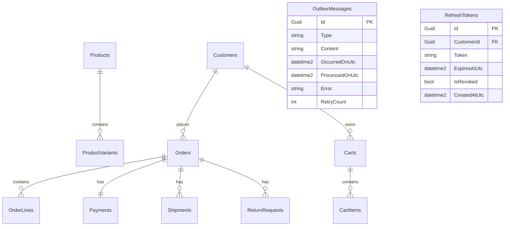

# Data Model & Infrastructure Mappings

**Feature**: 004-infrastructure-layer-persistence  
**Date**: 2026-07-25  

---

## 1. Database Entity Schemas (MSSQL via EF Core 9)



### Table Mappings & Owned Types

| Entity / Aggregate | Table Name | Owned Types / Value Objects | JSON Columns | Indexes / Constraints |
|--------------------|------------|-----------------------------|--------------|-----------------------|
| `Product` | `Products` | `BasePrice` (`Money`), `Slug` (`string`) | `Images` (`nvarchar(max)` JSON) | `IX_Products_Slug` (Unique), Filter: `!IsDeleted` |
| `ProductVariant` | `ProductVariants` | `PriceAdjustment` (`Money`), `Weight`, `Dimensions` | `Attributes` (`nvarchar(max)` JSON) | `IX_ProductVariants_Sku` (Unique) |
| `Customer` | `Customers` | `Email` (`string`), `Address` (`Address`) | - | `IX_Customers_Email` (Unique), Filter: `!IsDeleted` |
| `Cart` | `Carts` | - | - | `IX_Carts_CustomerId`, `IX_Carts_SessionId` |
| `CartItem` | `CartItems` | `UnitPrice` (`Money`) | - | PK: (`CartId`, `ProductVariantId`) |
| `Order` | `Orders` | `ShippingAddress` (`Address`), `Subtotal`, `Tax`, `ShippingCost`, `Discount`, `Total` | - | `IX_Orders_OrderNumber` (Unique) |
| `OrderLine` | `OrderLines` | `UnitPrice` (`Money`), `LineTotal` (`Money`) | - | PK: (`OrderId`, `ProductVariantId`) |
| `Payment` | `Payments` | `Amount` (`Money`) | - | `IX_Payments_OrderId`, `IX_Payments_IdempotencyKey` |
| `Shipment` | `Shipments` | `ShippingAddress` (`Address`) | - | `IX_Shipments_OrderId`, `IX_Shipments_TrackingNumber` |
| `Promotion` | `Promotions` | `Validity` (`DateRange`), `MaxDiscountAmount` (`Money`) | - | `IX_Promotions_Code` (Unique) |
| `ReturnRequest` | `ReturnRequests` | - | `Items` (`nvarchar(max)` JSON) | `IX_ReturnRequests_OrderId` |
| `AnalyticsEvent` | `AnalyticsEvents` | - | `Payload` (`nvarchar(max)` JSON) | `IX_AnalyticsEvents_CustomerId` |
| `VendorSettings` | `VendorSettings` | - | `RuntimeConfigJson` (`nvarchar(max)` JSON) | `IX_VendorSettings_VendorId` (Unique) |
| `OutboxMessage` | `OutboxMessages` | - | `Content` (`nvarchar(max)` JSON) | `IX_Outbox_Processed_Occurred` (`ProcessedOnUtc`, `OccurredOnUtc`) |
| `RefreshToken` | `RefreshTokens` | - | - | `IX_RefreshTokens_Token` (Unique) |

---

## 2. Infrastructure Entity Definitions

### `OutboxMessage` (EF Core Entity)
```csharp
public class OutboxMessage
{
    public Guid Id { get; set; }
    public string Type { get; set; } = string.Empty;
    public string Content { get; set; } = string.Empty;
    public DateTime OccurredOnUtc { get; set; }
    public DateTime? ProcessedOnUtc { get; set; }
    public string? Error { get; set; }
    public int RetryCount { get; set; }
}
```

### `RefreshToken` (EF Core Entity)
```csharp
public class RefreshToken
{
    public Guid Id { get; set; }
    public Guid CustomerId { get; set; }
    public string Token { get; set; } = string.Empty;
    public DateTime ExpiresAtUtc { get; set; }
    public bool IsRevoked { get; set; }
    public DateTime CreatedAtUtc { get; set; }
}
```
