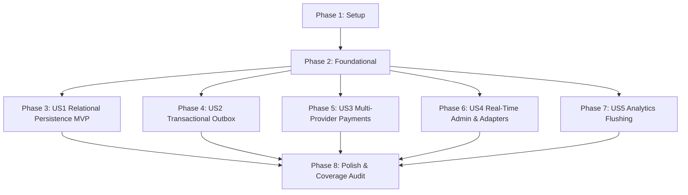

# Tasks: Infrastructure Layer & Persistence

**Input**: Design documents from `/specs/004-infrastructure-layer-persistence/`  
**Prerequisites**: plan.md, spec.md, research.md, data-model.md, contracts/, quickstart.md  
**Tests**: Unit and integration tests included per 85% infrastructure coverage target in constitution and spec.md  
**Organization**: Tasks are grouped by user story to enable independent implementation and testing.

## Format: `[ID] [P?] [Story] Description`

- **[P]**: Can run in parallel (different files, no dependencies)
- **[Story]**: Which user story this task belongs to (e.g., US1, US2, US3, US4, US5)
- Include exact file paths in descriptions

---

## Phase 1: Setup (Shared Infrastructure)

**Purpose**: Project initialization and package reference configuration for `Vendor.Infrastructure`

- [x] T001 Configure `src/Vendor.Infrastructure/Vendor.Infrastructure.csproj` targeting `net9.0` with EF Core 9 SQL Server (`Microsoft.EntityFrameworkCore.SqlServer`), MailKit, StackExchange.Redis, SignalR Redis backplane, Stripe.net, SendGrid, and references to `Vendor.Domain` & `Vendor.Application`
- [x] T002 [P] Configure `tests/Vendor.Infrastructure.Tests/Vendor.Infrastructure.Tests.csproj` with xUnit, FluentAssertions, NSubstitute, EF Core In-Memory, and reference to `Vendor.Infrastructure`

---

## Phase 2: Foundational (Blocking Prerequisites)

**Purpose**: Core `VendorDbContext`, `OutboxMessage` entity schema, `OutboxInterceptor`, and base persistence infrastructure

**⚠️ CRITICAL**: No user story implementation can begin until this phase is complete

- [x] T003 [P] Implement `OutboxMessage` entity schema and `RefreshToken` entity schema in `src/Vendor.Infrastructure/Outbox/OutboxMessage.cs` and `src/Vendor.Infrastructure/Auth/RefreshToken.cs`
- [x] T004 [P] Implement `VendorDbContext` inheriting `DbContext` and `IUnitOfWork` with `DbSet<T>` for all aggregates and outbox tables in `src/Vendor.Infrastructure/Persistence/VendorDbContext.cs`
- [x] T005 [P] Implement `DbIdempotencyStore` implementing `IIdempotencyStore` in `src/Vendor.Infrastructure/Persistence/DbIdempotencyStore.cs`
- [x] T006 [P] Implement `OutboxInterceptor` inheriting `SaveChangesInterceptor` to convert aggregate domain events to `OutboxMessage` rows in `src/Vendor.Infrastructure/Outbox/OutboxInterceptor.cs`
- [x] T007 Register `VendorDbContext`, `OutboxInterceptor`, and core persistence dependencies in `src/Vendor.Infrastructure/DependencyInjection.cs`

**Checkpoint**: Core persistence foundation ready — user story handler implementation can now begin

---

## Phase 3: User Story 1 - Relational Persistence with Value Objects and Soft Delete (Priority: P1) 🎯 MVP

**Goal**: Persist all 11 Domain aggregate roots to MSSQL via EF Core 9 with owned types for `Money` and `Address`, JSON columns for primitive lists/dicts, global query filters for soft delete (`!IsDeleted`), and 10 repository implementations.

**Independent Test**: Save aggregates with value objects, query directly to verify owned column mapping, soft delete records, and verify global query filter isolation.

- [x] T008 [P] [US1] Implement EF Core `IEntityTypeConfiguration<T>` for `Product` and `ProductVariant` (owned `Money`, JSON `Images` & `Attributes`, soft delete filter `!IsDeleted`, `IX_Products_Slug`, `IX_ProductVariants_Sku`) in `src/Vendor.Infrastructure/Persistence/Configurations/ProductConfiguration.cs`
- [x] T009 [P] [US1] Implement EF Core `IEntityTypeConfiguration<T>` for `Customer` (owned `Address`, soft delete filter `!IsDeleted`, `IX_Customers_Email`) in `src/Vendor.Infrastructure/Persistence/Configurations/CustomerConfiguration.cs`
- [x] T010 [P] [US1] Implement EF Core `IEntityTypeConfiguration<T>` for `Order` and `Payment` (owned `ShippingAddress`, owned monetary totals, `IX_Orders_OrderNumber`) in `src/Vendor.Infrastructure/Persistence/Configurations/OrderConfiguration.cs`
- [x] T011 [P] [US1] Implement 10 repository classes (`ProductRepository`, `CustomerRepository`, `CartRepository`, `OrderRepository`, `PaymentRepository`, `ShipmentRepository`, `PromotionRepository`, `ReturnRequestRepository`, `AnalyticsEventRepository`, `VendorSettingsRepository`) in `src/Vendor.Infrastructure/Persistence/Repositories/`
- [x] T012 [US1] Write unit and integration tests for EF Core entity mappings, owned types, soft delete filters, and repository persistence in `tests/Vendor.Infrastructure.Tests/Persistence/DbContextTests.cs`

**Checkpoint**: User Story 1 (Relational Persistence & Repositories MVP) complete and testable independently

---

## Phase 4: User Story 2 - Transactional Outbox Event Dispatching (Priority: P1)

**Goal**: Atomic outbox message insertion inside the aggregate SQL transaction and asynchronous event dispatching via background worker.

**Independent Test**: Mutate aggregate, verify `OutboxMessage` row created in same transaction, trigger background processor tick, verify MediatR domain event publication and timestamp update.

- [x] T013 [P] [US2] Implement `OutboxProcessorHostedService` polling loop (every 2s, batch 20, max 3 retries, dead-letter state) in `src/Vendor.Infrastructure/Outbox/OutboxProcessorHostedService.cs`
- [x] T014 [US2] Write unit tests for `OutboxInterceptor` event extraction and `OutboxProcessorHostedService` background publishing in `tests/Vendor.Infrastructure.Tests/Outbox/OutboxTests.cs`

**Checkpoint**: User Story 2 (Transactional Outbox Event Dispatching) complete and testable independently

---

## Phase 5: User Story 3 - Multi-Provider Payment Gateway Processing (Priority: P2)

**Goal**: Implement Stripe, PayPal, and Paymob payment adapters under `IPaymentGateway` with runtime `PaymentGatewayFactory` resolution, idempotency key propagation, and cryptographic webhook signature validation.

**Independent Test**: Verify payment gateway resolution, pass valid and invalid webhook signature payloads for Stripe (HMAC SHA-256), PayPal (REST verify endpoint), and Paymob (HMAC SHA-512 over sorted fields).

- [x] T015 [P] [US3] Implement `StripePaymentGateway` with PaymentIntents API, idempotency keys, and HMAC SHA-256 webhook validation in `src/Vendor.Infrastructure/Payments/StripePaymentGateway.cs`
- [x] T016 [P] [US3] Implement `PayPalPaymentGateway` with REST API v2 OAuth2 credentials and webhook verification endpoint in `src/Vendor.Infrastructure/Payments/PayPalPaymentGateway.cs`
- [x] T017 [P] [US3] Implement `PaymobPaymentGateway` with 3-step auth/order/payment-key flow and HMAC SHA-512 webhook validation over sorted parameters in `src/Vendor.Infrastructure/Payments/PaymobPaymentGateway.cs`
- [x] T018 [P] [US3] Implement `PaymentGatewayFactory` resolving configured payment adapter in `src/Vendor.Infrastructure/Payments/PaymentGatewayFactory.cs`
- [x] T019 [US3] Write unit tests for `PaymentGatewayFactory` resolution and Stripe, PayPal, Paymob webhook signature validation algorithms in `tests/Vendor.Infrastructure.Tests/Payments/WebhookValidationTests.cs`

**Checkpoint**: User Story 3 (Multi-Provider Payment Gateway Processing) complete and testable independently

---

## Phase 6: User Story 4 - Real-Time Admin Notifications, Auth, Shipping & Caching (Priority: P2)

**Goal**: Implement JWT token generation, OAuth external auth, shipping providers (FlatRate, Shippo), dual-mode caching (Memory vs Redis with SignalR backplane), real-time SignalR hub, and dual-mode email (SendGrid vs MailKit SMTP).

**Independent Test**: Issue JWT tokens, rotate refresh tokens, test cache fallback & invalidation, and verify SignalR hub typed method dispatching.

- [x] T020 [P] [US4] Implement `JwtTokenService` (30-min access tokens, 64-byte 7-day rotated refresh tokens) in `src/Vendor.Infrastructure/Auth/JwtTokenService.cs`
- [x] T021 [P] [US4] Implement `ExternalAuthService` calling Google `tokeninfo` and Facebook Graph API `/me` in `src/Vendor.Infrastructure/Auth/ExternalAuthService.cs`
- [x] T022 [P] [US4] Implement `FlatRateShippingProvider` and `ShippoShippingProvider` under `IShippingProvider` in `src/Vendor.Infrastructure/Shipping/ShippingProviders.cs`
- [x] T023 [P] [US4] Implement `InMemoryCacheService` (`IMemoryCache`) and `RedisCacheService` (`IDistributedCache`) in `src/Vendor.Infrastructure/Caching/CacheServices.cs`
- [x] T024 [P] [US4] Implement `AdminNotificationHub` (`/hubs/admin`, 8 typed client methods) and `SignalRRealtimeNotifier` (`IRealtimeNotifier`) in `src/Vendor.Infrastructure/Realtime/AdminNotificationHub.cs`
- [x] T025 [P] [US4] Implement `SendGridEmailSender` and `SmtpEmailSender` (MailKit) in `src/Vendor.Infrastructure/Email/EmailSenders.cs`
- [x] T026 [US4] Write unit tests for `JwtTokenService`, caching fallback, and real-time notifier dispatch in `tests/Vendor.Infrastructure.Tests/Auth/JwtTokenServiceTests.cs`

**Checkpoint**: User Story 4 (Real-Time Admin Notifications & Cross-Cutting Adapters) complete and testable independently

---

## Phase 7: User Story 5 - Consent-Gated Analytics Flushing (Priority: P3)

**Goal**: Implement thread-safe background queue buffering consent-gated analytics events and flushing every 30 seconds to GA4 / HTTP webhooks.

**Independent Test**: Buffer analytics events, verify consent-denied events are discarded, and verify periodic background flushing to mock HTTP endpoints.

- [x] T027 [P] [US5] Implement thread-safe `Channel<AnalyticsEvent>` queue and `AnalyticsProcessorHostedService` flushing every 30 seconds to GA4 / webhooks in `src/Vendor.Infrastructure/Analytics/AnalyticsProcessorHostedService.cs`
- [x] T028 [US5] Write unit tests for `AnalyticsProcessorHostedService` queue buffering and consent filtering in `tests/Vendor.Infrastructure.Tests/Analytics/AnalyticsProcessorTests.cs`

**Checkpoint**: User Story 5 (Consent-Gated Analytics Flushing) complete and testable independently

---

## Phase 8: Polish & Cross-Cutting Concerns

**Purpose**: Verify clean service registrations in DependencyInjection.cs, check line coverage target (≥85%), and run quickstart validation suite

- [x] T029 [P] Audit `src/Vendor.Infrastructure/DependencyInjection.cs` to verify clean service registration and configuration toggles
- [x] T030 Run full unit & integration test suite and generate coverage report to verify ≥ 85% Infrastructure line coverage threshold
- [x] T031 Execute all 5 validation scenarios from `quickstart.md` and confirm 100% test pass rate

---

## Dependencies & Execution Order

### Phase Dependencies

- **Setup (Phase 1)**: No dependencies — start immediately.
- **Foundational (Phase 2)**: Depends on Setup — **BLOCKS ALL USER STORIES**.
- **User Stories (Phases 3–7)**: Depend on Foundational completion. Stories US1 through US5 are independently testable.
- **Polish (Phase 8)**: Depends on all user stories being complete.

---

## Parallel Execution Opportunities

- **Phase 2 Foundational**: T003 (`OutboxMessage` & `RefreshToken`), T004 (`VendorDbContext`), T005 (`DbIdempotencyStore`), T006 (`OutboxInterceptor`) can all run concurrently.
- **Phase 3 (US1)**: T008 (`ProductConfig`), T009 (`CustomerConfig`), T010 (`OrderConfig`), T011 (10 Repositories) can run in parallel before T012 (`DbContextTests`).
- **Phase 5 (US3)**: T015 (`StripePaymentGateway`), T016 (`PayPalPaymentGateway`), T017 (`PaymobPaymentGateway`), T018 (`PaymentGatewayFactory`) can run in parallel before T019 (`WebhookValidationTests`).
- **Phase 6 (US4)**: T020 (`JwtTokenService`), T021 (`ExternalAuthService`), T022 (`ShippingProviders`), T023 (`CacheServices`), T024 (`AdminNotificationHub`), T025 (`EmailSenders`) can all be implemented concurrently across separate files.

---

## Implementation Strategy

### MVP Scope (Phases 1–3)
1. Complete Phase 1 (Setup) and Phase 2 (Foundational).
2. Complete Phase 3 (US1 — Relational Persistence & Repositories MVP).
3. Validate owned types, soft delete filters, and basic CRUD operations against MSSQL.

### Full Incremental Scope (Phases 1–8)
1. Setup + Foundational -> Core database & outbox infrastructure ready.
2. US1 -> Relational persistence & 10 repositories MVP.
3. US2 -> Transactional outbox pattern.
4. US3 -> Multi-provider payment gateways & webhook security.
5. US4 -> Real-time admin notifications, auth, shipping, dual-mode caching & email.
6. US5 -> Consent-gated analytics flushing.
7. Polish -> Coverage audit ≥ 85%, dependency injection validation, quickstart validation suite.
