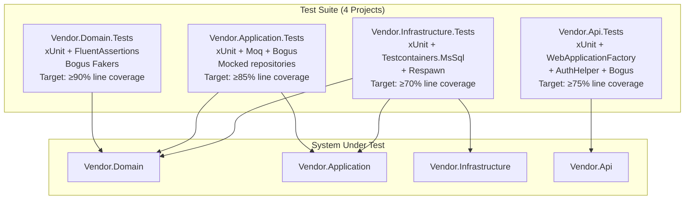
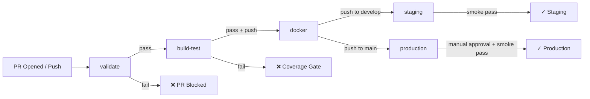
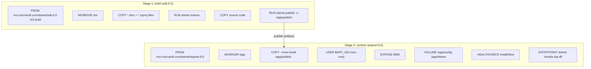

# Data Model: Test Suite & CI/CD Pipeline

**Feature**: 006-test-suite-cicd-pipeline  
**Date**: 2026-07-25

---

## Overview

This feature does not introduce new domain entities. Instead, it defines the **test-support models**, **fixture infrastructure**, and **CI/CD pipeline configuration schema** that enable exhaustive, automated verification of the existing domain.

The data model for this feature covers:
1. Test project architecture (which test types live where)
2. Test fixture/helper types
3. Pipeline job graph
4. Docker image layer model

---

## Test Pyramid Architecture

---

## Test Infrastructure Types

### MsSqlFixture (Infrastructure Tests)

Provides a shared SQL Server container and Respawn instance for all `[Collection("Database")]` test classes.

| Field | Type | Purpose |
|-------|------|---------|
| `Container` | `MsSqlContainer` | Testcontainers-managed SQL Server 2022 instance |
| `ConnectionString` | `string` | Resolved from container after start |
| `Respawner` | `Respawner` | Respawn instance for between-test state reset |
| `DbContextOptions` | `DbContextOptions<VendorDbContext>` | Shared options pointing to container DB |

**Lifecycle**:
- `InitializeAsync`: Start container → Apply EF Core migrations → Create `Respawner`
- `DisposeAsync`: Stop and remove container
- `ResetAsync()`: Called in `IAsyncLifetime.InitializeAsync` of each test class to reset tables via Respawn

**Ignored Tables**: `__EFMigrationsHistory`, `OutboxMessages` (configurable)

---

### VendorApiFactory (API Tests)

Extends `WebApplicationFactory<Program>` to configure the test host for integration testing.

| Field | Type | Purpose |
|-------|------|---------|
| Test JWT Secret | `string` (const) | 32-char HS256 signing key for test tokens |
| Test Issuer | `string` (const) | Matches issuer in `TokenValidationParameters` override |
| Test Audience | `string` (const) | Matches audience in `TokenValidationParameters` override |

**DI Overrides**:
- `PostConfigure<JwtBearerOptions>`: Replaces `TokenValidationParameters` with test key, issuer, audience; disables lifetime validation in test mode

---

### AuthHelper (API Tests)

Static helper class generating signed JWTs for endpoint authorization.

| Method | Token Claims | Intended Use |
|--------|-------------|--------------|
| `GenerateAdminToken()` | `role=Admin`, `sub=admin-001` | Admin-restricted endpoints |
| `GenerateCustomerToken(customerId)` | `role=Customer`, `sub={id}` | Customer-owned resource endpoints |
| `GenerateExpiredToken()` | Any role, past `exp` | Auth rejection test cases |

**Extension Methods on `HttpClient`**:
- `client.WithAdminBearerToken()`
- `client.WithCustomerBearerToken(customerId?)`

---

### Domain Fakers (All Test Projects)

Static `Faker<T>` factory classes using Bogus v3.x. Seed: `Randomizer.Seed = new Random(42)`.

| Faker Class | Domain Type | Key Rules |
|-------------|-------------|-----------|
| `CustomerFaker` | `Customer` | Valid email, phone, address via Bogus |
| `ProductFaker` | `Product` | Realistic name/price/slug combinations |
| `CartFaker` | `Cart` | 1–5 cart items, valid quantities |
| `OrderFaker` | `Order` | Valid `OrderLine[]`, Money values, Address |
| `PaymentFaker` | `Payment` | Amount matches order total, provider name |
| `ShipmentFaker` | `Shipment` | Tracking number, carrier from enum |
| `PromotionFaker` | `Promotion` | DateRange, discount %, code |

**Location**: Each test project has a `Generators/` subfolder containing the relevant fakers to avoid circular project references.

---

## CI/CD Pipeline Job Graph

### Job Definitions

| Job | Trigger | Runs On | Key Steps |
|-----|---------|---------|-----------|
| `validate` | PR + push | ubuntu-latest | ajv-cli schema validation, audit-secrets.js, hadolint |
| `build-test` | After `validate` | ubuntu-latest | dotnet build, dotnet test (×4), ReportGenerator coverage gate ≥80% |
| `docker` | After `build-test`, push to develop/main | ubuntu-latest | docker/login-action, docker/metadata-action, docker/build-push-action |
| `staging` | After `docker`, push to develop | ubuntu-latest | Deploy, curl /health/ready, curl /products smoke tests |
| `production` | After `docker`, push to main | ubuntu-latest | `environment: production` (manual approval gate), deploy, post-deploy health check |

---

## Docker Image Layer Model

### Volume Mount Contract

| Mount Path | Host Provider | Contents |
|------------|--------------|---------|
| `/app/config` | Vendor deployment | `vendor.config.json`, resolved secrets |
| `/app/theme` | Vendor deployment | CSS variables, logos, email templates |

---

## Packages Delta (what needs to be added/changed)

| Project | Add | Remove |
|---------|-----|--------|
| `Vendor.Infrastructure.Tests` | `Testcontainers.MsSql` v4.3.0, `Respawn` v6.2.1, `Bogus` v3.x, `Moq` v4.x | `Microsoft.EntityFrameworkCore.InMemory`, `NSubstitute` |
| `Vendor.Domain.Tests` | `Bogus` v3.x | — |
| `Vendor.Application.Tests` | `Bogus` v3.x | — |
| `Vendor.Api.Tests` | `Bogus` v3.x, `System.IdentityModel.Tokens.Jwt` v8.x | `NSubstitute` |
