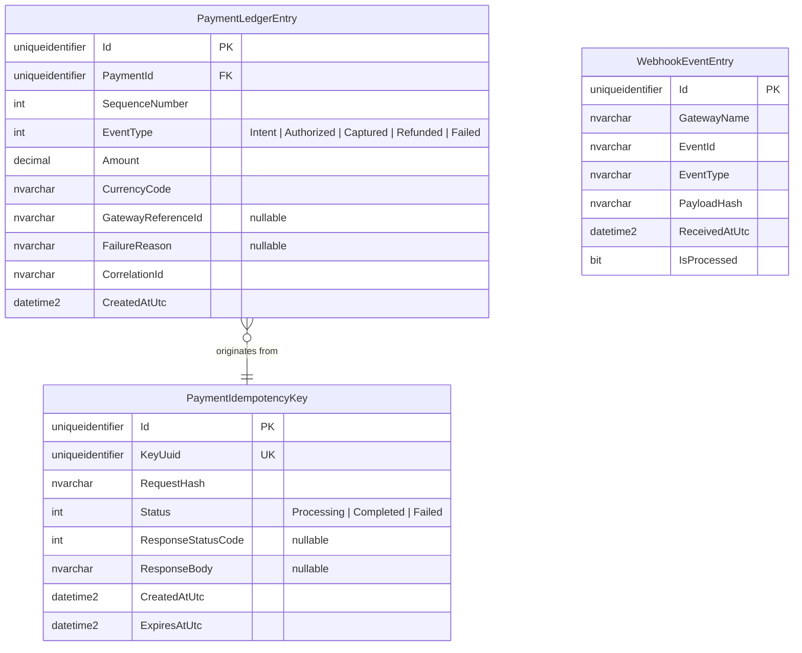
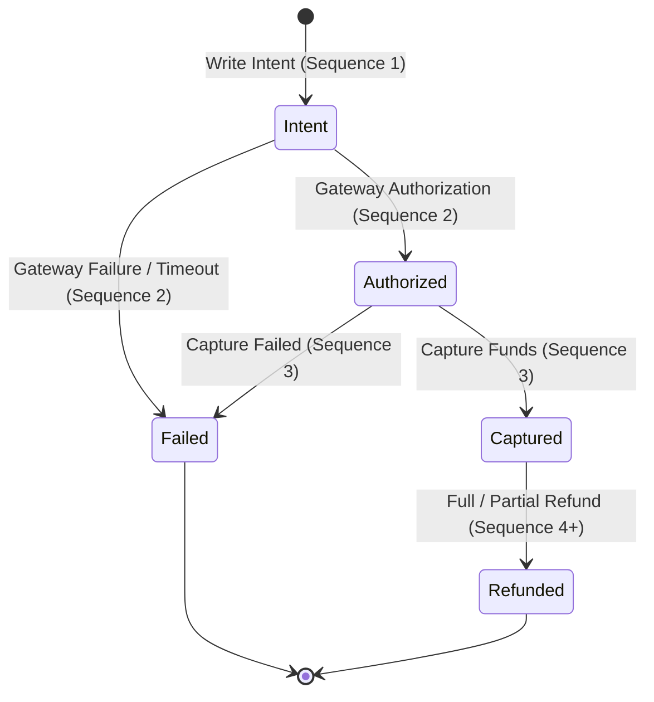

# Data Model Specification: Idempotent Payment Ledger

**Feature Branch**: `008-idempotent-payment-ledger`
**Date**: 2026-07-29

This document details the entities, value objects, state transitions, and validation rules for the Idempotent Payment Ledger feature.

---

## 1. Entity Diagram

---

## 2. Entities & Value Objects

### 2.1 PaymentIdempotencyKey
Tracks unique client payment request tokens to shield endpoints from duplicate execution.

- **Layer**: `Vendor.Domain.Aggregates.Payment`
- **Table**: `PaymentIdempotencyKeys`

| Property | Type | Constraints / Rules | Description |
|----------|------|--------------------|-------------|
| `Id` | `Guid` | Primary Key | Internal surrogate key |
| `KeyUuid` | `Guid` | Unique Index, Required | Client-supplied UUID v4 token |
| `RequestHash` | `string` | `nvarchar(64)`, Required | SHA256 hash of original request parameters |
| `Status` | `IdempotencyStatus` | Enum (`Processing`, `Completed`, `Failed`) | State of request execution |
| `ResponseStatusCode` | `int?` | Nullable | Cached HTTP status code (e.g. 200, 201, 400, 422) |
| `ResponseBody` | `string?` | `nvarchar(max)`, Nullable | Cached JSON string response |
| `CreatedAtUtc` | `DateTime` | Required | UTC timestamp of key registration |
| `ExpiresAtUtc` | `DateTime` | Required | Key retention expiration (default 24 hours after creation) |

---

### 2.2 PaymentLedgerEntry
Represents an immutable, append-only record in a payment's financial timeline.

- **Layer**: `Vendor.Domain.Aggregates.Payment`
- **Table**: `PaymentLedgerEntries`

| Property | Type | Constraints / Rules | Description |
|----------|------|--------------------|-------------|
| `Id` | `Guid` | Primary Key | Immutable ledger record ID |
| `PaymentId` | `Guid` | Index, Required | Unique identifier of the payment aggregate |
| `SequenceNumber` | `int` | Strictly Increasing (1..N) per `PaymentId` | Sequential step number in payment timeline |
| `EventType` | `PaymentLedgerEventType` | Enum (`Intent`, `Authorized`, `Captured`, `Refunded`, `Failed`) | Specific financial event type |
| `Amount` | `decimal` | Precision `(18,2)`, > 0 | Transaction monetary amount |
| `CurrencyCode` | `string` | `nvarchar(3)`, ISO 4217 | Monetary currency code |
| `GatewayReferenceId` | `string?` | `nvarchar(128)`, Nullable | Provider transaction identifier (e.g., Stripe `pi_123`) |
| `FailureReason` | `string?` | `nvarchar(512)`, Nullable | Reason for transaction failure if `EventType` is `Failed` |
| `CorrelationId` | `string` | `nvarchar(64)`, Required | Request tracing correlation ID |
| `CreatedAtUtc` | `DateTime` | Required | Exact UTC timestamp of entry insertion |

---

### 2.3 WebhookEventEntry
Tracks ingested external webhook notifications for signature verification and event deduplication.

- **Layer**: `Vendor.Domain.Aggregates.Payment`
- **Table**: `WebhookEventEntries`

| Property | Type | Constraints / Rules | Description |
|----------|------|--------------------|-------------|
| `Id` | `Guid` | Primary Key | Surrogate key |
| `GatewayName` | `string` | `nvarchar(32)`, Required | Gateway provider (e.g. `Stripe`, `PayPal`, `Paymob`) |
| `EventId` | `string` | Unique Index on `(GatewayName, EventId)`, Required | Provider's event identifier |
| `EventType` | `string` | `nvarchar(64)`, Required | Event type string (e.g., `payment_intent.succeeded`) |
| `PayloadHash` | `string` | `nvarchar(64)`, Required | SHA256 hash of raw webhook body |
| `ReceivedAtUtc` | `DateTime` | Required | UTC timestamp of ingestion |
| `IsProcessed` | `bool` | Required | Indication of successful ledger processing |

---

## 3. Enums & Value Objects

### 3.1 IdempotencyStatus (Enum)
- `Processing` (0): Request currently in-flight.
- `Completed` (1): Request finished successfully; response cached.
- `Failed` (2): Request finished with error; response cached.

### 3.2 PaymentLedgerEventType (Enum)
- `Intent` (1): Initial payment registration before gateway API dispatch.
- `Authorized` (2): External gateway approved/authorized funds.
- `Captured` (3): Funds settlement captured.
- `Refunded` (4): Full or partial refund issued.
- `Failed` (5): Payment processing or gateway attempt failed.

---

## 4. State Transition Rules

### Invariants
1. **Append-Only Integrity**: SQL `UPDATE` and `DELETE` queries are strictly forbidden on `PaymentLedgerEntries`.
2. **Sequence Numbering**: For a given `PaymentId`, sequence numbers MUST start at 1 and increment by 1 for each new entry.
3. **Payload Hash Matching**: If a key exists with `Status == Completed` or `Processing`, incoming request hashes MUST match. If not, return HTTP 422.
