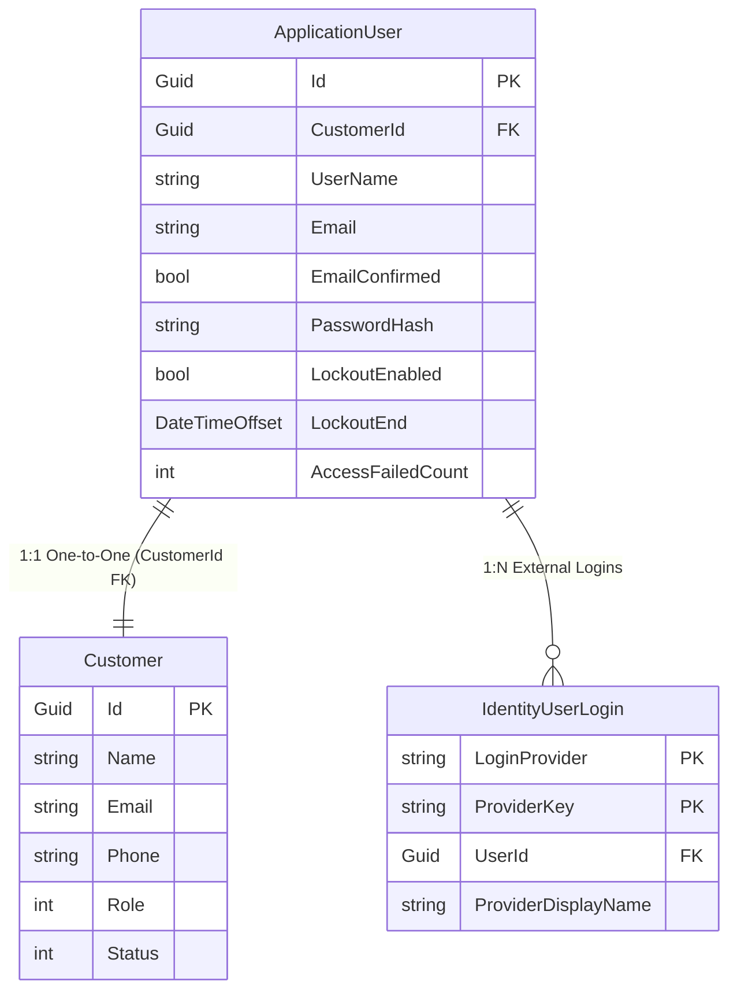

# Data Model: Identity Auth Integration

**Feature**: `009-identity-auth-integration`
**Date**: 2026-07-29

## 1. Entities & Schema Overview



---

## 2. Detailed Entity Specifications

### ApplicationUser Entity (`src/Vendor.Infrastructure/Identity/ApplicationUser.cs`)

Represents the authentication identity record mapped via EF Core Identity.

| Property | Type | Nullable | Description & Constraints |
|----------|------|----------|---------------------------|
| `Id` | `Guid` | No | Primary Key |
| `CustomerId` | `Guid` | No | Foreign Key referencing `Customers.Id` (Unique 1:1) |
| `UserName` | `string` | No | Set equal to Email address (Max length 256) |
| `Email` | `string` | No | Lowercase email address (Max length 256) |
| `EmailConfirmed` | `bool` | No | Flag indicating if email address is confirmed |
| `PasswordHash` | `string` | Yes | ASP.NET Core Identity PBKDF2 password hash |
| `LockoutEnabled` | `bool` | No | Enabled by default (`true`) |
| `LockoutEnd` | `DateTimeOffset?` | Yes | Lockout expiration timestamp when locked out |
| `AccessFailedCount` | `int` | No | Failed attempt counter (Threshold: 5 attempts -> 15 min lockout) |

---

### EF Core Entity Configuration (`ApplicationUserConfiguration.cs`)

```csharp
public class ApplicationUserConfiguration : IEntityTypeConfiguration<ApplicationUser>
{
    public void Configure(EntityTypeBuilder<ApplicationUser> builder)
    {
        builder.ToTable("AspNetUsers");

        builder.Property(u => u.CustomerId)
            .IsRequired();

        builder.HasIndex(u => u.CustomerId)
            .IsUnique();

        // Foreign Key constraint referencing Customers table
        builder.HasOne<Customer>()
            .WithOne()
            .HasForeignKey<ApplicationUser>(u => u.CustomerId)
            .OnDelete(DeleteBehavior.Cascade);
    }
}
```

---

## 3. Database Migration Requirements

- EF Core Migration: `AddIdentityAuthIntegration`
- Tables Affected:
  - `AspNetUsers`: Added `CustomerId` column (unique index, FK to `Customers.Id`).
  - `AspNetUserLogins`: Manages external provider keys (`Google`, `Facebook`).
  - `AspNetUserTokens` / `AspNetUserClaims`: Native Identity token tables.
